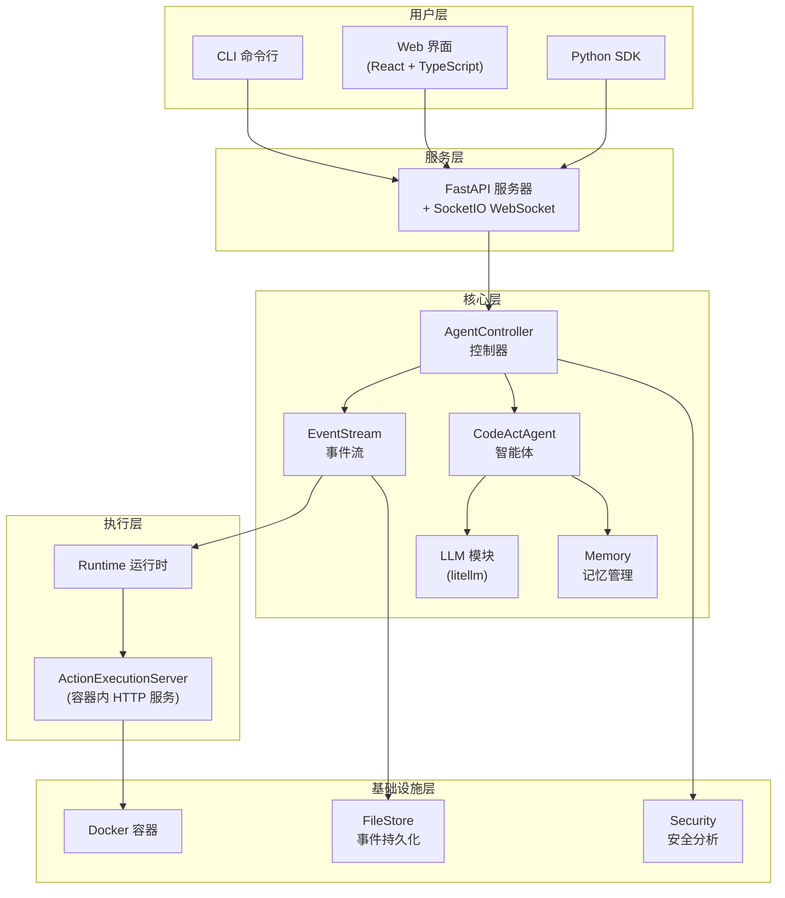
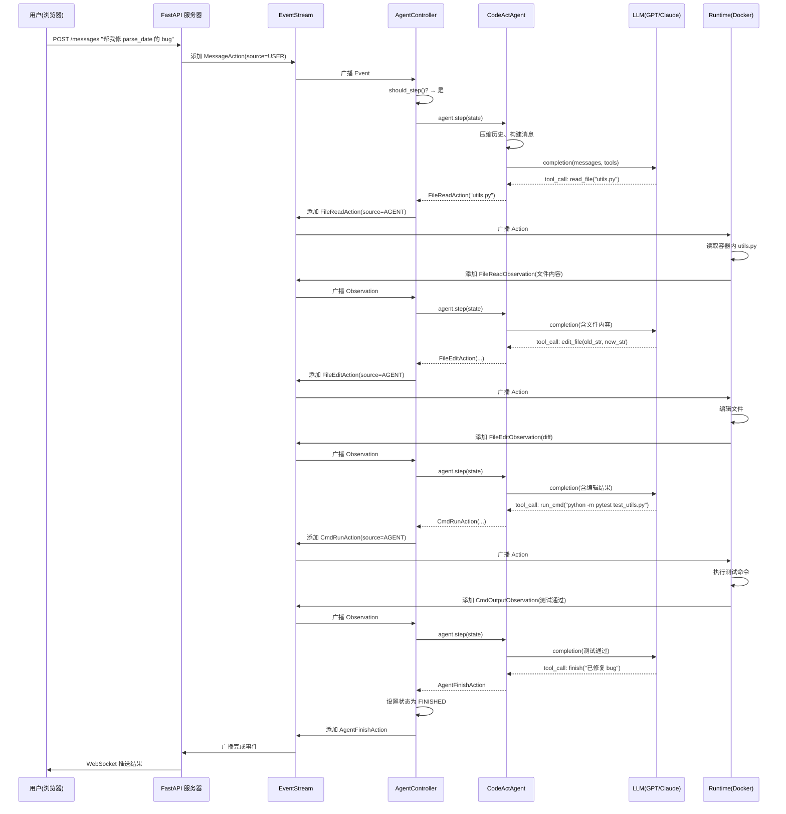

# 序章：全书地图

> 本章目标：用最短的篇幅，让你建立对 OpenHands 的完整心理模型——它是什么、它的架构长什么样、核心概念有哪些、代码库怎么组织、一次典型交互是怎么走完的。后续所有章节的深入，都在这张地图上展开。

---

## 0.1 OpenHands 是什么

想象这样一个场景：你打开一个网页聊天界面，用自然语言描述一个编程任务——"帮我在这个 Python 项目里加一个分页功能"。几秒钟后，一个 AI 开始自主工作：它阅读你的代码，在终端里执行命令，编辑文件，运行测试，遇到报错还会自己修复，直到任务完成。

这就是 OpenHands 做的事情。

**OpenHands 是一个 AI 驱动的软件开发平台。** 它的核心能力是：让大语言模型（LLM，Large Language Model）不只是"聊天"，而是像一个真正的开发者那样，拥有终端、编辑器、浏览器，能在一个安全隔离的环境中自主执行编程任务。

几个关键定位：

- **不是聊天机器人**：它能真正执行代码、修改文件、运行命令，而不只是生成文本
- **不是代码补全工具**：它是一个完整的自主 Agent（智能体），能规划、执行、验证、修正
- **安全隔离**：所有代码执行都在 Docker 沙箱中进行，不会影响你的本地环境
- **模型无关**：支持 GPT、Claude、Gemini 等 50+ 种大语言模型
- **多种使用方式**：命令行（CLI）、网页界面（GUI）、Python SDK、云服务、企业私有部署

在 SWE-Bench（一个衡量 AI 修复真实 GitHub Issue 能力的基准测试）中，OpenHands 达到了 77.6% 的解决率。

---

## 0.2 架构全景图

在深入任何细节之前，先看 OpenHands 的整体架构。整个系统可以分为五个层次：



逐层解释：

**用户层**：用户通过三种方式与 OpenHands 交互——命令行、网页界面、或 Python SDK。三种方式最终都连接到同一个后端服务。

**服务层**：一个 FastAPI 服务器处理 HTTP 请求，搭配 SocketIO 实现 WebSocket 双向通信（用于实时推送 Agent 的执行进度）。

**核心层**：这是 OpenHands 的大脑。AgentController（控制器）驱动整个循环；CodeActAgent（智能体）负责决策；LLM 模块负责与大语言模型通信；EventStream（事件流）是所有模块之间的通信总线；Memory 管理对话历史。

**执行层**：Runtime（运行时）负责在沙箱中执行 Agent 的指令。Docker 容器内部运行着一个 ActionExecutionServer——一个轻量级 HTTP 服务，接收并执行具体的命令、文件操作、浏览器操作等。

**基础设施层**：Docker 提供隔离执行环境；FileStore 负责事件的持久化存储；Security 模块对 Agent 的操作进行安全风险评估。

这五层中，**核心层**是本书的重点。后续章节会逐个打开这些模块的黑盒。

---

## 0.3 核心概念词典

OpenHands 有一套自己的概念体系，在阅读后续章节之前，需要先认识它们。

### Event（事件）

Event 是 OpenHands 中一切信息传递的基本单元。你可以把它理解为一封"信"——系统中发生的每一件事，都被封装成一个 Event，投递到 EventStream 中。

每个 Event 都带有：
- **id**：唯一递增编号
- **timestamp**：发生时间
- **source**：谁发出的——`AGENT`（智能体）、`USER`（用户）、还是 `ENVIRONMENT`（执行环境）
- **cause**：由哪个 Event 触发的（因果链）

Event 有两大子类：Action 和 Observation。

### Action（动作）

Action 是"想要做什么"——Agent 或用户发出的操作指令。常见的 Action 包括：

| Action 类型 | 含义 |
|------------|------|
| `CmdRunAction` | 在终端执行一条 Shell 命令 |
| `FileEditAction` | 编辑一个文件 |
| `FileReadAction` | 读取一个文件 |
| `IPythonRunCellAction` | 在 Jupyter 中执行 Python 代码 |
| `BrowseURLAction` | 用浏览器访问一个网址 |
| `MessageAction` | 发送一条文本消息 |
| `AgentFinishAction` | Agent 宣告任务完成 |
| `AgentThinkAction` | Agent 的内部思考（不执行任何操作） |
| `AgentDelegateAction` | 把子任务委托给另一个 Agent |

### Observation（观察）

Observation 是"发生了什么"——执行环境对 Action 的响应。常见的 Observation 包括：

| Observation 类型 | 含义 |
|-----------------|------|
| `CmdOutputObservation` | 命令的输出（含退出码） |
| `FileReadObservation` | 文件内容 |
| `FileEditObservation` | 编辑结果（含 diff） |
| `ErrorObservation` | 执行出错 |
| `BrowserOutputObservation` | 浏览器页面状态 |
| `AgentDelegateObservation` | 子 Agent 的执行结果 |

**Action 和 Observation 成对出现，构成一个"行动-反馈"循环**——Agent 发出 Action，环境返回 Observation，Agent 根据 Observation 决定下一步 Action。这个循环一直重复，直到任务完成或达到迭代上限。

### EventStream（事件流）

EventStream 是 OpenHands 的中央通信总线。所有 Action 和 Observation 都通过它传递。它同时承担三个职责：

1. **消息分发**：把 Event 广播给所有订阅者（Controller、Runtime、Server 等）
2. **持久化存储**：把每个 Event 序列化后写入 FileStore
3. **顺序保证**：为每个 Event 分配递增的 id，保证时序

### AgentController（控制器）

AgentController 是驱动整个系统运转的引擎。它订阅 EventStream，每当收到一个 Event：

1. 判断是否需要让 Agent "走一步"（step）
2. 如果需要，调用 Agent 的 `step()` 方法
3. Agent 返回一个 Action
4. Controller 进行安全检查后，将 Action 放入 EventStream
5. Runtime 收到 Action 并执行
6. Runtime 将 Observation 放入 EventStream
7. 回到第 1 步

Controller 还维护着一个**状态机**，管理 Agent 的生命周期（运行中、等待用户输入、已完成、出错等）。详见第 3 章。

### CodeActAgent（主力智能体）

OpenHands 注册了 6 种 Agent，其中 **CodeActAgent** 是默认且最核心的。它的能力包括：

- 执行 Shell 命令
- 执行 Python 代码（通过 Jupyter）
- 编辑文件（字符串替换或 LLM 辅助编辑）
- 浏览网页
- 内部思考（规划下一步）
- 跟踪任务进度

它通过 LLM 的 **Function Calling**（函数调用）能力来选择使用哪个工具——LLM 不是输出自然语言文本，而是输出结构化的工具调用请求，CodeActAgent 将其解析为对应的 Action。详见第 4 章。

### Runtime（运行时）

Runtime 是 Action 实际执行的地方。OpenHands 支持多种 Runtime 实现：

| Runtime | 场景 |
|---------|------|
| Docker Runtime | 默认选项，在 Docker 容器中执行 |
| Remote Runtime | 在远程服务器上执行 |
| Local Runtime | 在本机直接执行（风险较高） |
| Kubernetes Runtime | 在 K8s 集群中执行 |
| CLI Runtime | 命令行模式专用 |

所有 Runtime 共享同一个抽象接口，对上层完全透明。详见第 6 章。

---

## 0.4 代码库地图

了解了概念之后，来看它们在代码库中的位置。

```
openhands/                          ← Python 后端根目录
├── agenthub/                       ← 所有 Agent 的实现
│   ├── codeact_agent/              ← 主力 Agent
│   │   ├── codeact_agent.py        ← Agent 核心逻辑（step 方法）
│   │   └── function_calling.py     ← 响应解析为 Action
│   ├── browsing_agent/             ← 网页浏览专用 Agent
│   ├── readonly_agent/             ← 只读 Agent
│   ├── visualbrowsing_agent/       ← 可视化浏览 Agent
│   ├── loc_agent/                  ← 代码行数分析 Agent
│   └── dummy_agent/                ← 测试用空 Agent
│
├── controller/                     ← 控制器层
│   ├── agent_controller.py         ← 核心控制循环（1392 行）
│   ├── agent.py                    ← Agent 基类与注册机制
│   └── state/                      ← 状态管理
│       └── state.py                ← State 类
│
├── events/                         ← 事件系统
│   ├── event.py                    ← Event 基类
│   ├── stream.py                   ← EventStream 实现
│   ├── action/                     ← 所有 Action 类型定义
│   ├── observation/                ← 所有 Observation 类型定义
│   └── serialization/              ← 事件序列化/反序列化
│
├── llm/                            ← LLM 集成
│   ├── llm.py                      ← LLM 类（调用 litellm）
│   ├── fn_call_converter.py        ← 函数调用格式转换
│   └── router/                     ← 模型路由/降级
│
├── runtime/                        ← 运行时（执行层）
│   ├── base.py                     ← Runtime 抽象基类
│   ├── action_execution_server.py  ← 容器内执行服务
│   └── impl/                       ← 各 Runtime 实现
│       ├── docker/                 ← Docker Runtime
│       ├── remote/                 ← 远程 Runtime
│       ├── local/                  ← 本地 Runtime
│       ├── kubernetes/             ← K8s Runtime
│       └── cli/                    ← CLI Runtime
│
├── memory/                         ← 记忆管理
│   ├── condenser/                  ← 历史压缩器
│   └── conversation_memory.py      ← 对话历史转消息
│
├── server/                         ← Web 服务器
│   ├── listen.py                   ← 服务入口（FastAPI + SocketIO）
│   ├── listen_socket.py            ← WebSocket 事件处理
│   └── routes/                     ← API 路由
│
├── storage/                        ← 存储层
│   ├── files.py                    ← FileStore 实现
│   └── data_models/                ← 数据模型定义
│
└── security/                       ← 安全模块

frontend/                           ← React 前端
├── src/
│   ├── api/                        ← API 客户端
│   ├── components/                 ← UI 组件
│   ├── hooks/                      ← React Hooks（数据获取）
│   ├── routes/                     ← 页面路由
│   └── types/                      ← TypeScript 类型定义
```

一条简单的对应关系：**概念词典中的每个概念，都能在上面的代码地图中找到对应的目录或文件。** 例如 Event → `events/event.py`，AgentController → `controller/agent_controller.py`，Runtime → `runtime/base.py`。

---

## 0.5 一次典型交互：从"帮我修个 bug"到任务完成

现在用一个极简的流程，把前面的概念串起来。假设用户在网页界面输入：

> "项目里 `utils.py` 的 `parse_date` 函数有 bug，输入空字符串会崩溃，帮我修一下"

以下是这条消息从进入系统到任务完成的旅程：



逐步解说：

**第 1 步：用户消息进入系统。** 浏览器发送 HTTP 请求到 FastAPI 服务器，服务器将其封装为 `MessageAction`（来源标记为 `USER`），放入 EventStream。

**第 2 步：Controller 决定让 Agent 走一步。** Controller 订阅了 EventStream，收到用户消息后，判断当前状态允许步进，于是调用 `agent.step(state)`。

**第 3 步：Agent 调用 LLM 做决策。** CodeActAgent 将对话历史和可用工具一起发送给 LLM。LLM 返回一个结构化的"函数调用"——这里它决定先读取 `utils.py` 文件。

**第 4 步：Action 通过 EventStream 到达 Runtime。** `FileReadAction` 被放入 EventStream，Runtime（订阅者之一）收到后，在 Docker 容器内读取文件，将内容作为 `FileReadObservation` 放回 EventStream。

**第 5-8 步：循环继续。** Agent 看到文件内容后，再次调用 LLM，LLM 决定编辑文件修复 bug → 运行测试验证 → 测试通过后宣告完成。

**第 9 步：任务结束。** Controller 收到 `AgentFinishAction`，将 Agent 状态设为 `FINISHED`，Server 通过 WebSocket 将结果推送给用户浏览器。

注意整个过程的核心模式：**Agent → LLM → Action → EventStream → Runtime → Observation → EventStream → Agent**。这个循环就是 OpenHands 的心跳。后续每一章都在深入这个循环中的某一站。

---

## 0.6 全书路线图

本书按照**认知路径**组织——先建立直觉，再逐层深入：

| 阶段 | 章节 | 你会学到什么 |
|------|------|------------|
| 建立全局 | 序章（本章）| 心理模型：五层架构 + 核心概念 + 交互全流程 |
| 建立直觉 | 第 1 章 数据流全景 | 跟着一条数据走完全程，看清每一步的数据形态变化 |
| 基础设施 | 第 2 章 事件系统 | 所有模块通信的基础——Event、EventStream、序列化、持久化 |
| 主干流程 | 第 3 章 控制器 | 驱动循环的引擎——状态机、步进逻辑、委托机制 |
| 主干流程 | 第 4 章 CodeActAgent | 做决策的大脑——工具注册、消息构建、响应解析 |
| 主干流程 | 第 5 章 LLM 集成 | 思考能力——多模型适配、函数调用转换、重试与 token 管理 |
| 主干流程 | 第 6 章 运行时 | 执行命令的双手——Docker 容器生命周期、ActionExecutionServer |
| 支撑系统 | 第 7 章 记忆管理 | 不遗忘——历史压缩策略、上下文窗口管理 |
| 外围系统 | 第 8 章 服务端与前端 | 用户看到的——API 设计、WebSocket 实时通信、React 前端 |
| 横切关注 | 第 9 章 安全体系 | 保护机制——风险评估、确认模式、秘钥管理 |
| 理解演进 | 第 10 章 演进史 | 它是怎么长成现在这样的——从初始原型到企业级平台 |
| 总验收 | 第 11 章 端到端追踪 | 用一个完整场景串联全书，验证理解 |

每一章会在开头衔接上一章的内容，在结尾自然引出下一章要解决的问题。你可以顺序阅读，也可以在有了全局观之后跳到感兴趣的章节。

---

### 质检报告

**讲解节奏**
- [x] 每个模块先讲"它是什么"再讲"里面有什么"

**周边知识**
- [x] 设计决策处有足够背景（沙箱隔离的必要性、Function Calling 的解释）
- [x] 没有跨度过大的段落

**讲透了吗**
- [x] 核心流程每一步解释了数据变化
- [x] 没有跳步
- [x] 复杂节点已标注"详见第 N 章"

**代码纪律**
- [x] 全章代码片段 0 处（仅使用流程图和表格）
- [x] 没有超过 5 行的代码块

**流程图准确性**
- [x] 架构图基于实际源码结构确认
- [x] 序列图基于实际调用流程确认（EventStream 广播→Controller.on_event→Agent.step→LLM.completion→Runtime.run_action）
- [x] 图下方有逐步文字解释且与图对应

**过渡自然吗**
- [x] 章头无需衔接（第一章）
- [x] 章尾引出下一章（全书路线图）
- [x] 章内小节之间有衔接（概念→位置→串联）

**准确吗**
- [x] 行业标准术语使用正确
- [x] 项目特有术语已类比（EventStream→消息队列、Action→命令、Observation→响应）
- [x] 未确认内容无

**读得下去吗**
- [x] 术语首次出现有解释
- [x] 每张图有文字讲解

**勘误建议**
- 无
