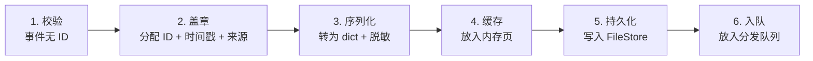
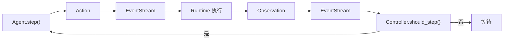

# 第 1 章：一次对话的完整旅程——数据流全景

> 序章给了你一张地图。这一章，我们沿着一条真实的数据，从用户敲下回车的那一刻开始，走完它在系统中的每一站。每一站，我们都会看清数据长什么样、经历了什么变化、为什么要这样变。

---

## 1.1 出发点：用户敲下回车

用户在网页界面的输入框里写了一句话：

> "帮我看看 utils.py 里有什么函数"

然后点击发送。浏览器发出一个 HTTP POST 请求：

```
POST /api/conversations/{conversation_id}/message
Content-Type: application/json

{"message": "帮我看看 utils.py 里有什么函数"}
```

此时，数据的形态是**一个纯文本字符串**，装在一个 JSON 对象里。它即将进入 OpenHands 的后端，开始一段漫长的旅程。

---

## 1.2 第一站：服务器接收——字符串变成 Action

FastAPI 服务器收到请求后，做的第一件事是把这个字符串包装成一个 **MessageAction** 对象。

**调用路径：**

```
openhands/server/routes/conversation.py::add_message()
  — 输入：HTTP 请求体 {"message": "帮我看看 utils.py 里有什么函数"}
  — 创建 MessageAction(content="帮我看看 utils.py 里有什么函数")
  — 将 MessageAction 序列化为 dict
  — 输出：一个事件字典，交给 ConversationManager
→ ConversationManager::send_event_to_conversation()
  — 将事件字典发送到对应会话的处理队列
```

**数据变化：**

此时，原本的纯文本字符串已经变成了一个结构化的事件对象。如果把这个对象序列化成 JSON，它长这样：

| 字段 | 值 | 含义 |
|------|-----|------|
| `action` | `"message"` | 事件类型：消息 |
| `source` | `"user"` | 来源：用户 |
| `args.content` | `"帮我看看 utils.py 里有什么函数"` | 消息内容 |
| `id` | 尚未分配 | 事件序号，由 EventStream 分配 |
| `timestamp` | 尚未分配 | 时间戳，由 EventStream 分配 |

为什么要做这层包装？因为 OpenHands 内部用**统一的事件模型**来表示一切——用户的消息、Agent 的命令、环境的反馈，全都是 Event。这样所有模块就可以用同一套机制来处理不同类型的信息。

---

## 1.3 第二站：EventStream——事件流的六步处理

MessageAction 到达 EventStream 后，经历一个严谨的六步处理流程：



逐步说明：

**第 1 步：校验。** 确保这个事件还没有被分配过 ID（防止重复添加）。

**第 2 步：盖章。** 这是关键一步——EventStream 为事件分配三个元数据：
- **id**：一个单调递增的整数，保证时序（通过锁保证线程安全）
- **timestamp**：当前时间的 ISO 8601 格式字符串
- **source**：事件来源（这里是 `USER`）

经过这一步，这个事件就有了在整个系统中的唯一身份。

**第 3 步：序列化与脱敏。** 事件对象被转为字典（dict），然后扫描其中所有字段，将敏感信息（如 API Key）替换为 `<secret_hidden>`。

**第 4 步：缓存。** 事件被放入内存中的"页缓存"。EventStream 把事件按页组织（默认每页 100 个事件），减少磁盘 I/O。

**第 5 步：持久化。** 事件的 JSON 被写入 FileStore（默认是本地文件系统，也可以是 S3 或 Google Cloud Storage）。文件名包含事件 ID，便于后续检索。

**第 6 步：入队。** 事件被放入一个线程安全的队列（Queue），等待被分发给所有订阅者。

注意第 5 步和第 6 步的顺序：**先持久化，后分发**。这意味着即使后续处理崩溃，事件已经被安全地保存下来了。

---

## 1.4 第三站：广播——事件到达每个订阅者

EventStream 的后台线程持续从队列中取出事件，广播给所有订阅者。当前系统中的订阅者包括：

| 订阅者 | 角色 |
|--------|------|
| `AGENT_CONTROLLER` | 控制器，决定 Agent 是否要走一步 |
| `RUNTIME` | 运行时，负责执行 Action |
| `SERVER` | 服务器，负责推送给前端 |
| `MEMORY` | 记忆模块，负责索引和检索 |

每个订阅者都在各自独立的线程池（ThreadPoolExecutor）中执行回调，互不阻塞。

对于我们这条 MessageAction：
- **Controller 收到它**，这是最关键的——它将决定下一步做什么
- **Server 收到它**，将通过 WebSocket 推送给前端，让用户看到自己的消息出现在聊天窗口中
- **Runtime 收到它**，但因为 MessageAction 不是一个"可运行"的 Action，Runtime 什么都不做

---

## 1.5 第四站：Controller 的决策——该不该让 Agent 走一步

Controller 收到这个 MessageAction 后，执行一段关键的决策逻辑。

**调用路径：**

```
openhands/controller/agent_controller.py::on_event(event)
  — 输入：MessageAction(source=USER)
  — 检查是否有活跃的 delegate（子 Agent）→ 没有
  — 转入 _on_event(event)
→ _on_event(event)
  — 将事件加入状态历史（state_tracker.add_history）
  — 识别为 Action → 调用 _handle_action(event)
  — _handle_message_action：
    — 识别为用户消息 → 创建 RecallAction（检索相关知识）
    — 将 Agent 状态设为 RUNNING
  — 调用 should_step(event)
  — 判定结果：True（用户消息总是触发步进）
→ _step_with_exception_handling()
  — 进入核心步进逻辑
```

**should_step 的判定规则**（简化版）：

| 事件类型 | 是否步进 | 原因 |
|----------|---------|------|
| 用户发的 MessageAction | ✅ 是 | 用户说了新话，Agent 需要响应 |
| Agent 发的 MessageAction | 视状态而定 | 如果 Agent 正在等待用户输入则不步进 |
| 普通 Observation | ✅ 是 | 上一个 Action 有了结果，Agent 需要看到并决定下一步 |
| AgentStateChangedObservation | ❌ 否 | 状态变更通知，不需要 Agent 响应 |
| NullObservation | ❌ 否 | 空响应，无需处理 |

这个判定逻辑看似简单，但至关重要——它决定了整个循环的节奏。不该步进时步进会浪费 LLM 调用（和费用），该步进时不步进会导致系统卡住。

---

## 1.6 第五站：Agent 的一步——从消息到决策

Controller 决定步进后，调用 Agent 的 `step()` 方法。这是整个数据流中**信息密度最高的一站**——在这里，对话历史被压缩成 LLM 能理解的消息序列，发送给大模型，然后把大模型的回复解析成具体的操作指令。

**调用路径：**

```
openhands/controller/agent_controller.py::_step()
  — 检查 Agent 状态 == RUNNING、无待处理 Action
  — 调用 agent.step(state)
→ openhands/agenthub/codeact_agent/codeact_agent.py::step(state)
  — 第1步：检查 pending_actions 队列（空，继续）
  — 第2步：检查用户是否输入了 /exit（否，继续）
  — 第3步：压缩历史
    → condenser.condensed_history(state)
    — 返回 View(events=[...], forgotten_event_ids={...})
  — 第4步：构建消息序列
    → _get_messages(condensed_history, initial_user_message, forgotten_event_ids)
    → conversation_memory.process_events(...)
    — 输出：list[Message]，LLM 可消费的消息列表
  — 第5步：调用 LLM
    → llm.completion(messages=messages, tools=tools)
    — 输出：ModelResponse（LLM 的原始响应）
  — 第6步：解析响应
    → response_to_actions(response)
    → codeact_function_calling.response_to_actions(response)
    — 输出：list[Action]
  — 第7步：返回第一个 Action，其余入队
```

这一站涉及多个复杂子系统（记忆压缩、消息构建、LLM 调用、响应解析），每个都值得单独一章来讲。这里我们只关注数据的形态变化。

**消息构建阶段的数据变化：**

对话历史中的 Event 列表（包含 Action 和 Observation）被转换为 LLM 能理解的消息格式：

| 转换前（Event 列表） | 转换后（Message 列表） |
|---------------------|---------------------|
| `MessageAction(content="帮我看看...", source=USER)` | `Message(role="user", content="帮我看看...")` |
| `CmdRunAction(command="ls", source=AGENT)` | `Message(role="assistant", tool_calls=[...])` |
| `CmdOutputObservation(content="file1.py\nfile2.py")` | `Message(role="tool", content="file1.py\nfile2.py")` |

同时，系统提示词（System Prompt）作为第一条消息，告诉 LLM 它是一个软件工程助手，有哪些工具可用。

**LLM 的回复：**

假设 LLM 决定先读取 `utils.py` 文件，它的回复（ModelResponse）中会包含一个结构化的函数调用：

| 字段 | 值 |
|------|-----|
| `tool_calls[0].function.name` | `"read"` |
| `tool_calls[0].function.arguments` | `{"path": "utils.py"}` |

**解析后：**

这个函数调用被解析为一个 `FileReadAction(path="utils.py")` 对象。这就是 Agent 这一步的产出——一个明确的操作指令。

---

## 1.7 第六站：Action 进入 EventStream，到达 Runtime

Agent 返回的 FileReadAction 被 Controller 放入 EventStream（来源标记为 `AGENT`）。

EventStream 重复第二站的六步处理：分配 ID、打时间戳、序列化、缓存、持久化、入队分发。

这一次，关键的订阅者是 **Runtime**。

Runtime 收到 FileReadAction 后，判断这是一个"可运行"的 Action（`runnable = True`），于是开始执行。

**调用路径：**

```
openhands/runtime/base.py::on_event(event)
  — 输入：FileReadAction(path="utils.py", source=AGENT)
  — 判断是 Action → 调用 _handle_action(event)
→ openhands/runtime/impl/action_execution/action_execution_client.py::_handle_action(event)
  — 设置超时时间
  — 调用 run_action(event)
→ action_execution_client.py::send_action_for_execution(action)
  — 将 Action 序列化为 JSON
  — 发送 HTTP POST 到容器内的 ActionExecutionServer
  — URL: http://localhost:{port}/execute_action
  — 请求体: {"action": {...Action 的 JSON 表示...}}
  — 接收响应
  — 将响应反序列化为 Observation
  — 输出：FileReadObservation(content="文件内容...", path="utils.py")
→ _handle_action 将 Observation 放入 EventStream（source=ENVIRONMENT）
```

**数据变化——HTTP 请求与响应：**

发送到容器的请求：

| 字段 | 值 |
|------|-----|
| `action.action` | `"read"` |
| `action.args.path` | `"utils.py"` |

容器内 ActionExecutionServer 读取文件后返回：

| 字段 | 值 |
|------|-----|
| `observation` | `"read"` |
| `content` | `"def parse_date(s):\n    ..."` （文件内容） |
| `extras.path` | `"utils.py"` |

注意这里有一个重要的架构决策：**Runtime 不直接在主进程中执行操作，而是通过 HTTP 与容器内的执行服务通信。** 这样做的好处是隔离——即使执行的命令导致容器崩溃，主进程也不受影响。代价是每次操作都有一次网络往返。对于大多数场景，这个延迟可以忽略不计。

---

## 1.8 第七站：Observation 回到 EventStream，循环继续

FileReadObservation 被放入 EventStream 后，再次广播给所有订阅者。

Controller 收到这个 Observation，再次执行 should_step 判定——普通 Observation 的判定结果是 **True**，于是再次调用 `agent.step(state)`。

这一次，Agent 的对话历史中多了两条记录：
1. 自己上一步发出的 FileReadAction
2. 环境返回的 FileReadObservation（包含文件内容）

LLM 看到文件内容后，可能返回一条 MessageAction 告诉用户文件中有哪些函数，然后返回 AgentFinishAction 表示任务完成。

整个循环的节奏是：



这个循环会一直转下去，直到以下任一条件满足：
- Agent 发出 **AgentFinishAction**（任务完成）
- Agent 发出 **AgentRejectAction**（拒绝任务）
- 达到**最大迭代次数**
- 达到**最大预算**
- 用户主动**停止**
- 发生**不可恢复的错误**

---

## 1.9 终点站：任务完成

当 Agent 发出 AgentFinishAction 后，Controller 将 Agent 的状态设为 `FINISHED`。这个状态变更也会作为事件（AgentStateChangedObservation）放入 EventStream。

Server 订阅者收到完成事件后，通过 WebSocket 将结果推送给前端。用户在浏览器中看到 Agent 的回复和任务完成标记。

至此，一条数据的旅程走完了。让我们回顾这条数据在整个旅途中经历的身份变化：

| 阶段 | 数据形态 | 所在位置 |
|------|---------|---------|
| 用户输入 | 纯文本字符串 | 浏览器 |
| HTTP 请求 | JSON `{"message": "..."}` | 网络传输 |
| 服务器处理后 | MessageAction 对象 | FastAPI 服务器 |
| EventStream 处理后 | 带 id/timestamp/source 的 MessageAction | EventStream |
| 持久化后 | JSON 文件 | FileStore（磁盘） |
| Controller 处理后 | State 中的历史记录 | AgentController |
| Agent 构建消息后 | Message 对象列表 | CodeActAgent |
| LLM 调用时 | HTTP 请求体（消息+工具定义） | litellm → OpenAI/Claude API |
| LLM 返回后 | ModelResponse（含 tool_calls） | CodeActAgent |
| 解析后 | FileReadAction 对象 | CodeActAgent → Controller |
| Runtime 发送时 | HTTP POST JSON | 主进程 → Docker 容器 |
| 容器内执行后 | 文件内容字符串 | ActionExecutionServer |
| Runtime 接收后 | FileReadObservation 对象 | Runtime → EventStream |
| 前端展示 | HTML 渲染的聊天消息 | 浏览器 |

一条数据，从纯文本出发，经历了十几次形态变化，穿越了进程边界和容器边界，最终又变回用户能看懂的文本。整个 OpenHands 的架构，就是为了让这个过程安全、可靠、可追溯地发生。

---

## 1.10 三个值得记住的设计选择

在追踪数据流的过程中，有三个设计选择贯穿始终，值得在深入后续章节之前记住：

**事件驱动，而非直接调用。** Controller 不直接调用 Runtime 的方法，而是将 Action 放入 EventStream，Runtime 作为订阅者自行取出并执行。这样做的好处是**解耦**——如果要换一种 Runtime 实现（比如从 Docker 换成 Kubernetes），只需要换订阅者，Controller 的代码一行不用改。

**先持久化，后处理。** EventStream 在广播事件之前先写入磁盘。这意味着系统崩溃后可以从磁盘恢复事件历史，继续之前的对话。这是事件溯源（Event Sourcing）模式的典型应用。

**容器内执行，HTTP 通信。** 代码执行不发生在主进程中，而是通过 HTTP 与 Docker 容器内的一个独立服务通信。这提供了安全隔离，但也引入了网络延迟和序列化开销。

这三个选择各有取舍，在后续章节中你会看到它们如何影响系统的具体实现。

---

这一章我们跟着数据走了一遍全程，建立了对系统运作的直觉。但在很多站点，我们只看到了"发生了什么"，没有深入"怎么发生的"。其中最基础的一个站点是 EventStream——所有模块都通过它通信，所有数据都经过它中转。它到底是怎么工作的？事件的序列化、存储、分发机制是什么样的？这就是下一章要解答的问题。

---

### 质检报告

**讲解节奏**
- [x] 每个模块先讲"它是什么"再讲"里面有什么"

**周边知识**
- [x] 设计决策处有足够背景（为什么事件驱动、为什么 HTTP 通信、为什么先持久化）
- [x] 没有跨度过大的段落

**讲透了吗**
- [x] 核心流程每一步解释了数据变化（每站都有数据形态表格）
- [x] 没有跳步
- [x] 复杂节点已标注将在后续章节展开（Agent.step 内的子系统、should_step 详细逻辑等）

**代码纪律**
- [x] 全章代码片段 0 处（使用调用路径 + 表格替代）
- [x] 没有超过 5 行的代码块

**流程图准确性**
- [x] EventStream 六步流程图基于 stream.py 的 add_event() 实现确认
- [x] 循环流程图基于 controller → agent.step → eventstream → runtime 的实际调用链确认
- [x] 图下方有逐步文字解释且与图对应

**过渡自然吗**
- [x] 章头衔接序章（"序章给了你一张地图。这一章沿着一条真实的数据走…"）
- [x] 章尾引出下一章（"EventStream 到底是怎么工作的？"→ 第 2 章）
- [x] 章内小节之间有衔接（每站自然过渡到下一站）

**准确吗**
- [x] 调用路径基于实际源码文件和方法名
- [x] 数据结构字段基于实际类定义
- [x] 未确认内容无

**读得下去吗**
- [x] 术语首次出现有解释
- [x] 每张图有文字讲解

**勘误建议**
- 无
