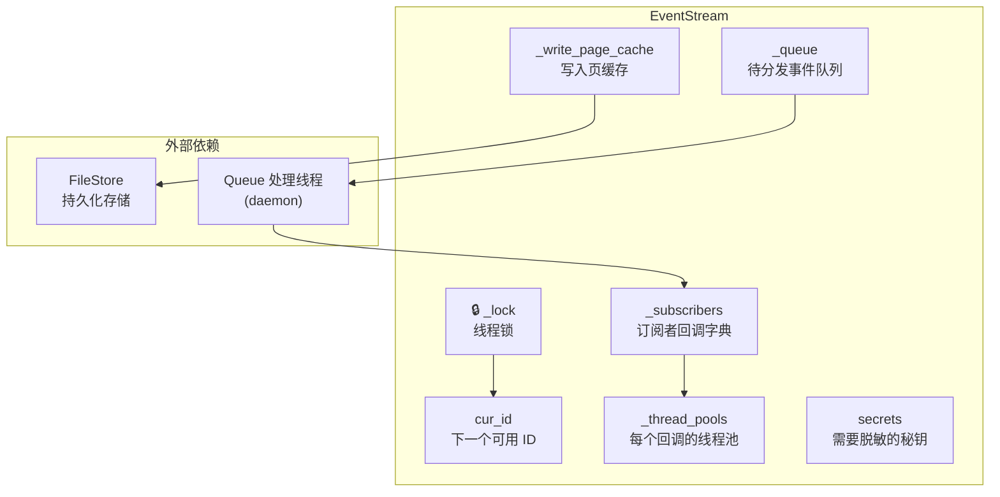
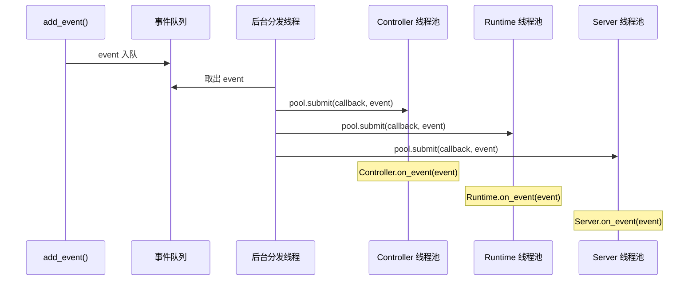
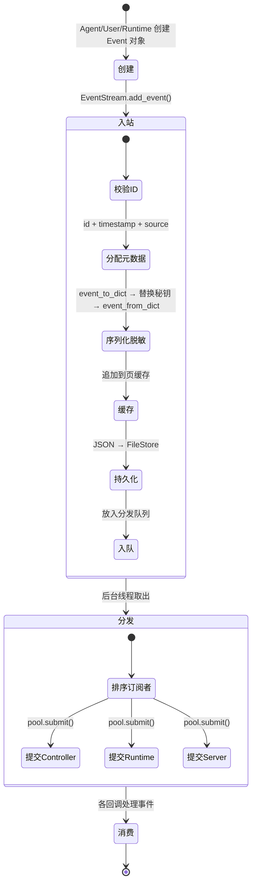

# 第 2 章：事件系统——OpenHands 的神经网络

> 上一章我们跟着一条数据走了全程，发现每一站都绕不开 EventStream。Controller 通过它接收消息，Agent 的决策通过它分发，Runtime 的执行结果通过它回传。EventStream 是 OpenHands 一切通信的枢纽。这一章，我们把这个黑盒打开。

---

## 2.1 为什么需要事件系统

在最朴素的设计中，Controller 可以直接调用 Runtime 的方法来执行命令，Runtime 可以直接把结果返回给 Controller。这种"直接调用"的方式简单直观，但有几个问题：

**耦合问题。** 如果 Controller 直接调用 Docker Runtime 的方法，当你想换成 Kubernetes Runtime 时，Controller 的代码也要改。

**持久化问题。** 如果对话中途系统崩溃，所有对话历史都丢了。用户必须从头开始。

**多订阅者问题。** 一个 Action 不只是 Runtime 要看——Server 也要看（推送给前端），Memory 模块也要看（建立索引）。直接调用无法优雅地通知多个模块。

**可追溯问题。** 在调试时，你想知道"Agent 第 5 步做了什么"，但如果事件没有被统一记录，你很难回溯。

这些问题的共同解法是引入一个**中央事件总线**——所有信息都通过它传递，它负责存储、排序、分发。这就是 EventStream 的角色。这个模式在分布式系统中非常常见，OpenHands 将它应用到了 AI Agent 的场景中。

---

## 2.2 事件模型：Event、Action、Observation

### Event——一切的基类

Event 是事件系统的原子单位。OpenHands 中发生的每一件事——用户说了一句话、Agent 决定执行一条命令、Runtime 返回了执行结果——都是一个 Event。

每个 Event 都携带以下元数据：

| 属性 | 类型 | 含义 | 由谁设置 |
|------|------|------|---------|
| `id` | 整数 | 全局唯一递增编号 | EventStream |
| `timestamp` | ISO 8601 字符串 | 事件发生时间 | EventStream |
| `source` | 枚举：AGENT / USER / ENVIRONMENT | 谁发出了这个事件 | EventStream |
| `cause` | 整数（可选） | 触发本事件的前序事件 ID | 创建者 |
| `timeout` | 浮点数（可选） | 执行超时时间 | 创建者 |
| `llm_metrics` | Metrics 对象（可选） | LLM 调用的 token 用量和费用 | Agent |
| `tool_call_metadata` | ToolCallMetadata（可选） | 函数调用的元数据 | Agent |

注意 `id`、`timestamp`、`source` 这三个关键属性不是创建者设的，而是 EventStream 在 `add_event()` 时统一分配的。这保证了**全局一致性**——不管谁创建了事件，编号和时间戳都由同一个来源分配。

### Action——"想做什么"

Action 继承自 Event，表示一个操作指令。它有一个类级别的标记 `runnable`，表示这个 Action 是否需要 Runtime 执行：

| Action 类型 | runnable | 含义 |
|------------|----------|------|
| `CmdRunAction` | ✅ | 执行 Shell 命令 |
| `FileReadAction` | ✅ | 读取文件 |
| `FileEditAction` | ✅ | 编辑文件 |
| `IPythonRunCellAction` | ✅ | 执行 Python 代码 |
| `BrowseURLAction` | ✅ | 浏览网页 |
| `MessageAction` | ❌ | 纯文本消息（不需要执行） |
| `AgentThinkAction` | ❌ | Agent 内部思考（不需要执行） |
| `AgentFinishAction` | ❌ | 任务完成声明 |
| `AgentDelegateAction` | ❌ | 委托给子 Agent |

这个 `runnable` 标记决定了 Runtime 收到事件后的行为——如果是 `runnable` 的 Action，Runtime 会执行它；否则直接忽略或返回空响应。

每个 Action 还携带一个 **安全风险等级**（ActionSecurityRisk）：

| 等级 | 值 | 含义 |
|------|-----|------|
| UNKNOWN | -1 | 尚未评估 |
| LOW | 0 | 低风险 |
| MEDIUM | 1 | 中风险 |
| HIGH | 2 | 高风险，可能需要用户确认 |

### Observation——"发生了什么"

Observation 同样继承自 Event，表示执行结果或环境反馈。它的核心字段是 `content`——一个字符串，承载了实际的输出内容。

不同类型的 Observation 在 `content` 之外还有各自的专属字段。例如 `CmdOutputObservation` 有 `exit_code`（进程退出码），`FileEditObservation` 有 `diff`（文件变更对比），`BrowserOutputObservation` 有 `url` 和 `screenshot`。

**Action 和 Observation 通过 `cause` 字段链接。** 当 Runtime 执行一个 Action 并产生 Observation 时，Observation 的 `cause` 会被设为该 Action 的 `id`。这样就形成了因果链：

```
Event #5: CmdRunAction(command="ls")     ← Agent 发出
Event #6: CmdOutputObservation(cause=5)  ← Runtime 返回，标记是 #5 的结果
```

---

## 2.3 EventStream：中央事件总线

EventStream 继承自 EventStore（存储抽象），在持久化的基础上增加了**实时分发**能力。它是整个系统的信息枢纽。

### 内部结构

EventStream 管理着以下核心数据结构：



逐个说明：

- **`_lock`**（线程锁）：保护 `cur_id` 和 `_write_page_cache` 的并发访问。持有时间极短，只覆盖 ID 分配和缓存更新。
- **`cur_id`**：下一个可用的事件 ID，单调递增。
- **`_queue`**：线程安全的事件队列，`add_event()` 往里放，后台线程从中取。
- **`_subscribers`**：二级字典，结构为 `{订阅者类型: {回调ID: 回调函数}}`。
- **`_thread_pools`**：与 `_subscribers` 结构对应，每个回调函数有一个独立的单线程线程池。
- **`_write_page_cache`**：当前正在写入的事件页。默认每 25 个事件组成一页，整页一起缓存到磁盘以加速读取。
- **`secrets`**：需要脱敏的秘钥键值对，序列化时会把这些值替换为 `<secret_hidden>`。

### add_event()——事件进入系统的入口

第 1 章已经概述了 `add_event` 的六步流程。这里我们关注几个关键的设计细节。

**为什么先序列化再反序列化？** 在第 3 步中，事件被序列化为 dict，执行脱敏，然后又从 dict 反序列化回 Event 对象。这看起来像是多余的操作，实际上有两个目的：
1. **脱敏发生在序列化后的 dict 上**，这样可以统一扫描所有字段的值，无论事件类型。
2. **反序列化后的 Event 是"干净"的**——它的内容已经过脱敏，后续分发给订阅者的就是这个安全版本。

**为什么持久化在锁的外面？** 写磁盘（FileStore.write）是耗时操作，如果放在锁里面，所有其他线程都必须等写磁盘完成后才能分配新的 ID。所以 OpenHands 在锁内只做最快的操作（分配 ID、更新缓存指针），然后在锁外写磁盘。

**页缓存的作用是什么？** 除了逐个事件写入磁盘外，EventStream 还把事件按页（默认 25 个）批量写入一个缓存文件。读取历史事件时，如果缓存页存在，可以一次读取 25 个事件（一次磁盘 I/O），而不是读 25 个单独的文件（25 次磁盘 I/O）。这是一个典型的**读优化**策略。

### 订阅与分发

EventStream 的分发机制基于**发布-订阅模式**（Pub/Sub），但有几个特别之处：

**每个回调有独立的线程池。** 当你调用 `subscribe()` 注册一个回调时，EventStream 会为这个回调创建一个独立的 `ThreadPoolExecutor`（最大线程数为 1）。这意味着：
- 不同订阅者的回调并行执行
- 同一个回调的事件串行处理（避免并发冲突）

**每个线程池有独立的事件循环。** 因为 OpenHands 大量使用 async/await，每个线程池的工作线程在初始化时会创建自己的 `asyncio` 事件循环。这样回调函数内部可以运行异步代码。

**订阅者按排序顺序接收事件。** 后台线程分发事件时，会按订阅者 ID 的字母序排列。这保证了分发顺序的确定性——在调试时很有用。

**分发流程：**



注意后台分发线程只负责**提交任务**到各个线程池，不等待任务完成。这意味着分发是非阻塞的——一个订阅者的回调耗时不会阻塞其他订阅者。

---

## 2.4 事件序列化：Event 与 JSON 之间的转换

事件在两个场景下需要序列化：
1. **持久化到磁盘**：写入 FileStore 时
2. **网络传输**：发送到 Docker 容器内的 ActionExecutionServer 时

OpenHands 的序列化策略是将 Event 转为 Python 字典（dict），再转为 JSON 字符串。

### Action 的序列化结构

Action 被序列化时，事件本身的类型信息放在顶层 `action` 字段，所有 Action 特有的参数放在 `args` 字典中：

| 字段 | 含义 | 示例 |
|------|------|------|
| `id` | 事件编号 | `5` |
| `timestamp` | 时间戳 | `"2024-01-15T10:30:45.123456"` |
| `source` | 来源 | `"agent"` |
| `action` | Action 类型标识 | `"run"` / `"read"` / `"edit"` |
| `args` | Action 的参数字典 | `{"command": "ls -la", "blocking": true}` |
| `timeout` | 超时（可选） | `300` |

### Observation 的序列化结构

Observation 的序列化有一个重要区别：主要输出放在 `content` 字段（顶层），辅助信息放在 `extras` 字典中：

| 字段 | 含义 | 示例 |
|------|------|------|
| `id` | 事件编号 | `6` |
| `timestamp` | 时间戳 | `"2024-01-15T10:30:47.987654"` |
| `source` | 来源 | `"environment"` |
| `observation` | Observation 类型标识 | `"run"` / `"read"` / `"error"` |
| `content` | 主要输出内容 | `"total 42\ndrwxr-xr-x..."` |
| `extras` | 辅助信息字典 | `{"exit_code": 0, "command": "ls -la"}` |

**为什么 Action 用 `args`，Observation 用 `content` + `extras`？** 因为两者的信息结构不同。Action 是一个指令，它的所有字段都是"参数"，地位平等。Observation 是一个结果，有一个明确的"主要输出"（content），其他都是辅助元数据。这个结构上的区分让消费方可以快速获取最关键的信息。

### 反序列化：类型路由

从 dict 恢复为 Event 对象时，关键在于确定具体类型。系统维护一个映射表 `ACTION_TYPE_TO_CLASS`，将字符串标识映射到 Python 类：

```
"run"    → CmdRunAction
"read"   → FileReadAction
"edit"   → FileEditAction
"browse" → BrowseURLAction
"message" → MessageAction
"finish" → AgentFinishAction
...
```

反序列化时还需要处理**向后兼容**——旧版本的事件 JSON 可能包含已更名或废弃的字段。例如 `is_confirmed` 被重命名为 `confirmation_state`，`images_urls` 被重命名为 `image_urls`。反序列化代码中有专门的兼容逻辑处理这些变化。

---

## 2.5 持久化：事件如何存在磁盘上

EventStream 将事件写入 FileStore。FileStore 是一个抽象接口，支持多种后端实现：本地文件系统、AWS S3、Google Cloud Storage。不同后端对上层完全透明。

### 文件命名与组织

每个事件是一个独立的 JSON 文件。文件路径遵循这样的命名规则：

```
sessions/{session_id}/events/{event_id}.json
```

页缓存文件的命名规则：

```
sessions/{session_id}/events/cache/{start_id}-{end_id}.json
```

例如，一个会话中前 50 个事件的存储结构大致如下：

```
sessions/abc123/events/
├── 0.json          ← 事件 0（单独文件）
├── 1.json          ← 事件 1
├── 2.json          ← ...
├── ...
├── 24.json         ← 事件 24
├── 25.json         ← 事件 25
├── ...
├── 49.json         ← 事件 49
└── cache/
    ├── 0-25.json   ← 事件 0-24 的批量缓存
    └── 25-50.json  ← 事件 25-49 的批量缓存
```

**读取策略：** 恢复历史时，EventStream 优先尝试读取缓存页（一次 I/O 读 25 个事件）。如果缓存页不存在（比如最近的事件还不满一页），就逐个读取单独的 JSON 文件。

### 脱敏机制

在序列化并写入磁盘之前，EventStream 会扫描事件 dict 中的所有值，如果发现与 `secrets` 字典中的值匹配，就替换为 `<secret_hidden>`。

需要注意的是：
- 脱敏只针对**值**，不针对**键**。也就是说 `{"api_key": "sk-12345"}` 会变成 `{"api_key": "<secret_hidden>"}`，而不是整个字段被删除
- 顶层的元数据字段（id、timestamp、source、cause、action、observation）被保护，不会被脱敏
- 脱敏是递归的——嵌套在任意深度的 dict 或 list 中的秘钥值都会被替换

---

## 2.6 完整的事件生命周期

把前面的内容串起来，一个事件从创建到被所有订阅者消费，经历的完整生命周期如下：



**关键保证：**

- **顺序性**：ID 是单调递增的，事件在队列中先进先出
- **持久性**：事件在分发前已写入磁盘
- **隔离性**：订阅者之间互不阻塞
- **一致性**：所有订阅者收到的是同一个（经脱敏的）事件对象

---

## 2.7 为什么这样设计

回到本章开头的四个问题，看 EventStream 如何逐一解决：

| 问题 | EventStream 的解法 |
|------|-------------------|
| 耦合 | Controller 和 Runtime 不直接交互，只通过 EventStream 收发事件。换 Runtime 实现只需更换订阅者 |
| 持久化 | 每个事件写入 FileStore，崩溃后可恢复 |
| 多订阅者 | 发布-订阅模式，一个事件自动广播给所有订阅者 |
| 可追溯 | 每个事件有 ID、时间戳、因果链，完整的操作历史可回溯 |

当然，这个设计也有代价：

- **内存开销**：每个回调一个线程池、一个事件循环
- **延迟**：事件需要经过队列和线程调度才能到达订阅者，比直接函数调用慢
- **磁盘 I/O**：每个事件都要写磁盘（虽然有页缓存优化）

对于 AI Agent 的场景，这些代价是可以接受的——LLM 的推理时间（通常数秒）远大于事件分发的延迟（通常毫秒级），磁盘写入的开销也相对于网络请求来说微不足道。

---

事件系统解决了"信息如何传递"的问题。但谁来决定信息传递的节奏？谁来判断"现在该让 Agent 走一步"还是"该等待"？谁来处理 Agent 卡死、超时、出错的情况？这就是下一章的主角——AgentController，OpenHands 的决策中枢。

---

### 质检报告

**讲解节奏**
- [x] 每个模块先讲"它是什么"再讲"里面有什么"（先解释为什么需要事件系统→再讲 Event 模型→再讲 EventStream 内部）

**周边知识**
- [x] 设计决策处有足够背景（为什么用 Pub/Sub、为什么先持久化后分发、页缓存的读优化原理）
- [x] 没有跨度过大的段落

**讲透了吗**
- [x] EventStream 的 add_event 六步详细拆解了每步的数据变化
- [x] 没有跳步
- [x] 复杂节点（FileStore 各后端实现、SecurityAnalyzer 脱敏细节）不是本章重点，已提及不深入

**代码纪律**
- [x] 全章代码片段 0 处（全部使用表格、流程图、调用路径替代）
- [x] 没有超过 5 行的代码块

**流程图准确性**
- [x] EventStream 内部结构图基于 stream.py 的实际属性确认
- [x] 分发序列图基于 _process_queue() 的实际实现确认
- [x] 生命周期状态图与 add_event() 的实际步骤一一对应

**过渡自然吗**
- [x] 章头衔接上一章（"上一章发现每一站都绕不开 EventStream"）
- [x] 章尾引出下一章（"谁来决定信息传递的节奏？"→ AgentController）
- [x] 章内小节之间有因果衔接

**准确吗**
- [x] 序列化结构基于 event_to_dict() 源码确认
- [x] 文件命名规则基于 _get_filename_for_id() 确认
- [x] 未确认内容无

**读得下去吗**
- [x] 术语首次出现有解释（Pub/Sub、页缓存、线程池）
- [x] 每张图有文字讲解

**勘误建议**
- 无
