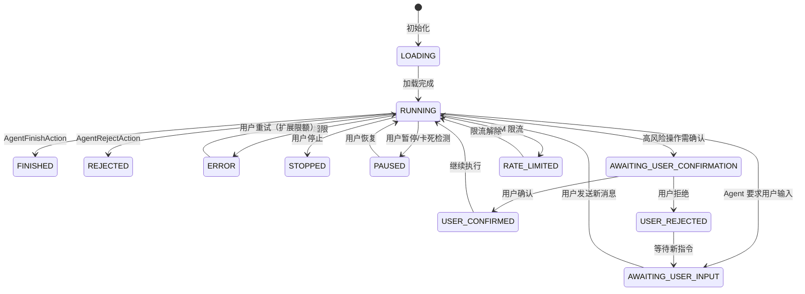
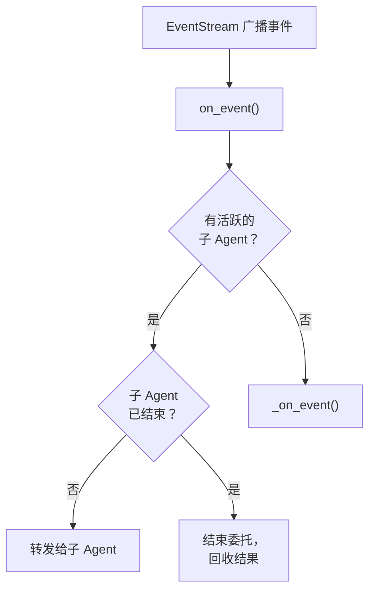
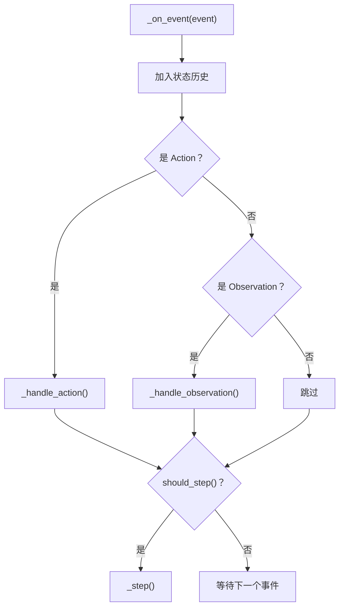
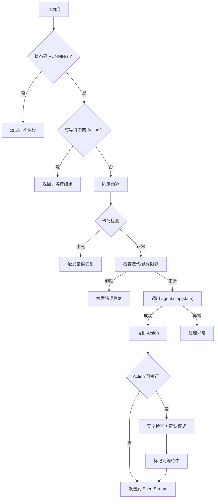
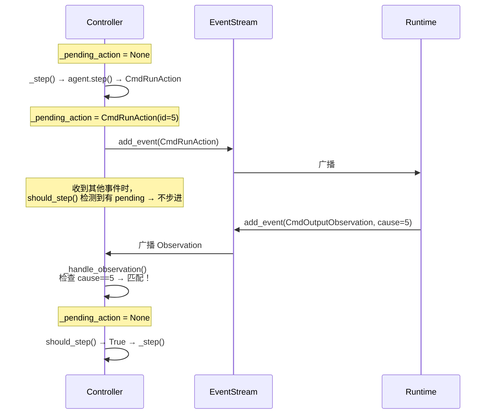
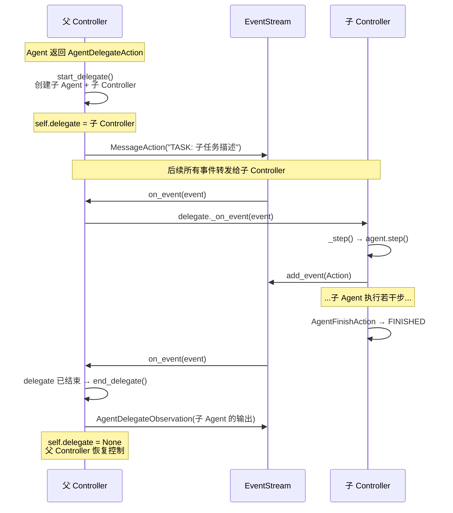

# 第 3 章：控制器——决策中枢

> 上一章我们打开了 EventStream 的黑盒，看清了事件如何存储和分发。但事件不会自己驱动——谁来决定"现在该让 Agent 走一步"？谁来处理 Agent 返回的结果？谁来在 Agent 卡死时介入？这就是 AgentController 的职责。如果说 EventStream 是 OpenHands 的神经网络，AgentController 就是它的大脑皮层——接收信号、做出判断、发出指令。

---

## 3.1 AgentController 是什么

AgentController 是 OpenHands 的**中央控制循环**。它不自己思考（那是 Agent 和 LLM 的事），也不自己执行命令（那是 Runtime 的事），但它控制着整个流程的节奏：

- **什么时候让 Agent 走一步**（收到用户消息？还是收到执行结果？）
- **Agent 返回的 Action 怎么处理**（直接执行？还是先让用户确认？）
- **出了状况怎么办**（Agent 卡死了？超预算了？超过最大步数了？）
- **多个 Agent 协作时谁先谁后**（委托子 Agent、收回结果）

用一句话概括：**AgentController 是 Agent 和环境之间的调度层。**

---

## 3.2 状态机：Agent 的生命周期

Controller 内部维护着一个**状态机**，跟踪 Agent 当前处于什么阶段。这个状态决定了 Controller 对事件的响应方式。



各状态的含义：

| 状态 | 含义 | Agent 可步进？ |
|------|------|-------------|
| `LOADING` | 正在初始化 | ❌ |
| `RUNNING` | 正在执行任务 | ✅ |
| `AWAITING_USER_INPUT` | 等待用户输入新指令 | ❌ |
| `AWAITING_USER_CONFIRMATION` | 等待用户确认高风险操作 | ❌ |
| `USER_CONFIRMED` | 用户已确认 | 转 RUNNING 后 ✅ |
| `USER_REJECTED` | 用户已拒绝 | 转 AWAITING_USER_INPUT |
| `PAUSED` | 用户暂停 / 卡死暂停 | ❌ |
| `FINISHED` | 任务完成 | ❌（终态） |
| `REJECTED` | Agent 拒绝任务 | ❌（终态） |
| `ERROR` | 发生错误 | ❌（可重试） |
| `STOPPED` | 用户主动停止 | ❌（终态） |
| `RATE_LIMITED` | LLM API 限流 | ❌（等待解除） |

注意 `FINISHED`、`REJECTED`、`STOPPED` 是**终态**——一旦进入就不会再变。而 `ERROR` 是**可恢复的**——用户可以选择重试，此时系统会自动扩展迭代次数和预算上限，让 Agent 有更多空间完成任务。

每次状态变更都会触发两个副作用：
1. 向 EventStream 发送一个 `AgentStateChangedObservation`，通知所有订阅者
2. 将当前状态持久化到磁盘，用于崩溃恢复

---

## 3.3 一步的完整流程

Controller 收到一个事件后，到底发生了什么？这是最核心的流程，分为三个阶段。

### 阶段一：事件路由



Controller 通过 `on_event()` 回调接收 EventStream 的事件。第一个判断是：**是否有活跃的子 Agent（delegate）？**

- 如果有，且子 Agent 还在运行，事件直接转发给子 Agent 处理
- 如果有，但子 Agent 已结束（FINISHED/ERROR/REJECTED），则调用 `end_delegate()` 收回结果
- 如果没有，进入 `_on_event()` 由父 Controller 自行处理

这个机制实现了**多 Agent 协作**——父 Agent 可以把子任务委托给另一个 Agent，在委托期间，所有事件都由子 Agent 处理，父 Agent 暂时让出控制权。详见 3.6 节。

### 阶段二：事件处理



`_on_event()` 的处理分三步：

1. **记录历史**：把事件加入 State 的历史列表，供 Agent 后续参考
2. **分类处理**：
   - **Action**：根据类型路由——MessageAction 触发 Agent 进入 RUNNING 状态；AgentFinishAction 将状态设为 FINISHED；AgentDelegateAction 启动子 Agent
   - **Observation**：检查是否匹配当前等待的 Action（通过 `cause` 字段），如果匹配则清除等待标记
3. **步进判定**：调用 `should_step()` 决定是否需要让 Agent 走一步

### 阶段三：Agent 步进

这是最复杂的部分。`_step()` 方法的完整流程可以分为七个阶段：



逐步解说：

**前置检查。** 必须是 RUNNING 状态，且没有正在等待响应的 Action。如果上一个 Action 还没收到 Observation，Controller 不会让 Agent 走下一步——这是**一次一个 Action** 的串行执行模型。

**同步预算。** 将 LLM 的实际花费同步到预算控制标志中，确保预算检查基于最新数据。

**卡死检测。** 检查 Agent 是否陷入循环（详见 3.5 节）。

**限额检查。** 检查迭代次数和预算是否超限。每步进一次，迭代计数器加 1。如果达到上限，抛出异常。

**调用 Agent。** 这是信息密度最高的一步——调用 `agent.step(state)`，Agent 内部会压缩历史、构建消息、调用 LLM、解析响应，最终返回一个 Action。如果 LLM 返回了上下文窗口溢出错误，Controller 会触发历史压缩（Condensation）而不是直接报错。

**安全检查与确认模式。** 如果启用了确认模式（confirmation_mode），对于可执行的 Action（命令执行、文件编辑、浏览器操作等），Controller 会调用安全分析器评估风险。如果风险为 HIGH，Action 不会立即执行，而是将状态设为 `AWAITING_USER_CONFIRMATION`，等待用户手动确认。

**发送事件。** Action 被放入 EventStream，触发 Runtime 执行（如果是可执行的 Action）或被其他订阅者消费。

---

## 3.4 等待与恢复：pending_action 机制

Controller 维护着一个 `_pending_action` 字段，记录当前正在等待 Runtime 响应的 Action。



这个机制保证了**严格的请求-响应模式**：Controller 发出一个 Action 后，在收到对应的 Observation 之前不会发出下一个 Action。匹配依据是 Observation 的 `cause` 字段等于 Action 的 `id`。

如果用户在确认模式下拒绝了一个操作，Controller 会清除 pending_action 并将状态设为 `AWAITING_USER_INPUT`，等待用户的新指令。

---

## 3.5 卡死检测：当 Agent 陷入循环

AI Agent 有一个常见问题：**陷入循环**。比如 Agent 反复尝试同一条命令，每次都失败，但不知道换一种方式。OpenHands 通过 StuckDetector 来识别这种情况。

StuckDetector 监测五种循环模式：

| 模式 | 描述 | 最少步数 | 触发条件 |
|------|------|---------|---------|
| 重复动作-响应 | 同一个 Action 产生同一个 Observation | 3 | 连续 4 次完全相同 |
| 重复动作-错误 | 同一个 Action 连续产生错误 | 3 | 连续 3 次相同错误 |
| 自言自语 | Agent 连续发同样的消息 | 3 | 连续 3 条相同消息，中间无 Observation |
| 交替模式 | 两种操作交替出现 | 6 | 最近 6 步呈现 A-B-A-B-A-B 模式 |
| 上下文窗口循环 | 反复触发历史压缩 | 10 | 连续 10+ 次压缩事件，无其他操作 |

检测到卡死后，Controller 的处理方式取决于运行模式：

- **非交互模式**（headless）：直接触发错误恢复，Controller 向 EventStream 发送一个 `LoopDetectionObservation`，Agent 会在下一步看到这个"你卡住了"的提示
- **交互模式**（CLI）：暂停 Agent，给用户三个选择——从循环前重试、用最后的指令重试、或直接停止

---

## 3.6 委托机制：多 Agent 协作

OpenHands 支持一个 Agent 将子任务委托给另一个 Agent。例如，CodeActAgent 在需要复杂的网页操作时，可以委托给 BrowsingAgent。

### 委托的工作原理



几个关键设计细节：

**共享 EventStream。** 子 Controller 不创建新的 EventStream，而是共用父级的。这意味着子 Agent 的所有操作都被记录在同一个事件流中，保持完整的审计轨迹。

**共享控制标志。** 迭代计数器和预算计数器是**引用共享**的——子 Agent 消耗的迭代次数和预算，直接从总额中扣除。这防止了嵌套委托导致的预算失控。

**不订阅 EventStream。** 子 Controller 的 `is_delegate=True`，意味着它不直接订阅 EventStream。事件是由父 Controller 的 `on_event()` 手动转发的。这保证了事件路由的确定性。

**结果回传。** 子 Agent 完成后，父 Controller 将其输出封装为 `AgentDelegateObservation`，放入 EventStream。父 Agent 在下一步 `step()` 时会看到这个 Observation，了解子任务的执行结果。

---

## 3.7 控制标志：迭代和预算的双重保险

为了防止 Agent 无限运行（不管是 bug 还是复杂任务），Controller 维护两个控制标志：

**IterationControlFlag**：跟踪步进次数。每次 `_step()` 执行前，迭代计数器加 1。达到上限时抛出异常，Agent 进入 ERROR 状态。

**BudgetControlFlag**：跟踪 LLM 调用的费用（美元）。每次 `_step()` 执行前，从 LLM 的 Metrics 中同步实际花费。达到预算上限时抛出异常。

当用户选择"重试"时（从 ERROR 恢复到 RUNNING），系统会调用 `maybe_increase_control_flags_limits()` 自动扩展上限，给 Agent 更多空间。这是一个实用的设计——避免了用户反复手动调整参数。

---

## 3.8 Controller 的完整调用路径总结

把本章的内容串联成一个完整的调用路径：

```
EventStream 广播事件
→ on_event(event)
  ├─ 有委托？→ 转发给 delegate._on_event()
  └─ 无委托？→ _on_event(event)
      ├─ 加入历史
      ├─ 分类处理
      │   ├─ MessageAction(USER) → 创建 RecallAction + 设为 RUNNING
      │   ├─ AgentDelegateAction → start_delegate() 创建子 Agent
      │   ├─ AgentFinishAction → 设为 FINISHED
      │   ├─ AgentRejectAction → 设为 REJECTED
      │   └─ Observation → 匹配 pending_action？→ 清除等待
      └─ should_step()?
          → _step()
              ├─ 前置检查（RUNNING？无 pending？）
              ├─ 同步预算
              ├─ 卡死检测
              ├─ 限额检查
              ├─ agent.step(state) → 得到 Action
              ├─ 安全检查 + 确认模式
              └─ add_event(Action) → EventStream
```

到这里，我们已经理解了 Controller 如何驱动循环、管理状态、处理异常。但 Controller 只是调度者——真正的决策发生在 `agent.step(state)` 这一步。Agent 是怎么根据对话历史做出决策的？它是怎么告诉 LLM"你现在有哪些工具可以用"的？LLM 的回复又是怎么被解析成 Action 的？这就是下一章的内容——OpenHands 的主力智能体 CodeActAgent。

---

### 质检报告

**讲解节奏**
- [x] 先讲 Controller 是什么（3.1）→ 再讲状态机（3.2）→ 再讲步进流程（3.3）→ 再讲内部机制

**周边知识**
- [x] 状态机设计决策有解释（为什么 ERROR 可恢复、为什么需要确认模式）
- [x] 多 Agent 协作的设计动机有解释

**讲透了吗**
- [x] _step() 七阶段完整拆解
- [x] pending_action 机制用序列图讲透
- [x] 卡死检测五种模式逐一说明
- [x] 委托机制四个关键设计细节

**代码纪律**
- [x] 全章代码片段 0 处
- [x] 使用流程图 + 序列图 + 表格 + 调用路径替代

**流程图准确性**
- [x] 状态机基于 AgentState 枚举和 set_agent_state_to() 确认
- [x] _step() 流程图基于实际实现确认
- [x] 委托序列图基于 start_delegate()/end_delegate() 确认

**过渡自然吗**
- [x] 章头衔接上一章（"EventStream 是神经网络，Controller 是大脑皮层"）
- [x] 章尾引出下一章（"真正的决策发生在 agent.step()"→ CodeActAgent）
- [x] 章内各节因果衔接

**准确吗**
- [x] 11 个 AgentState 值与源码一致
- [x] 控制标志共享机制与 start_delegate() 源码一致
- [x] 未确认内容无

**读得下去吗**
- [x] 所有状态首次出现有含义说明
- [x] 每张图有逐步文字解说

**勘误建议**
- 无
