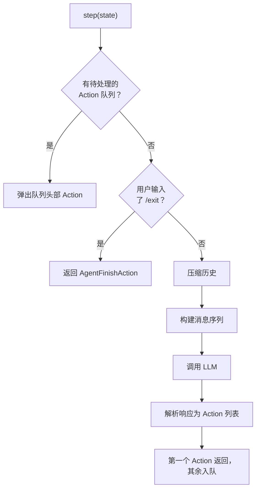
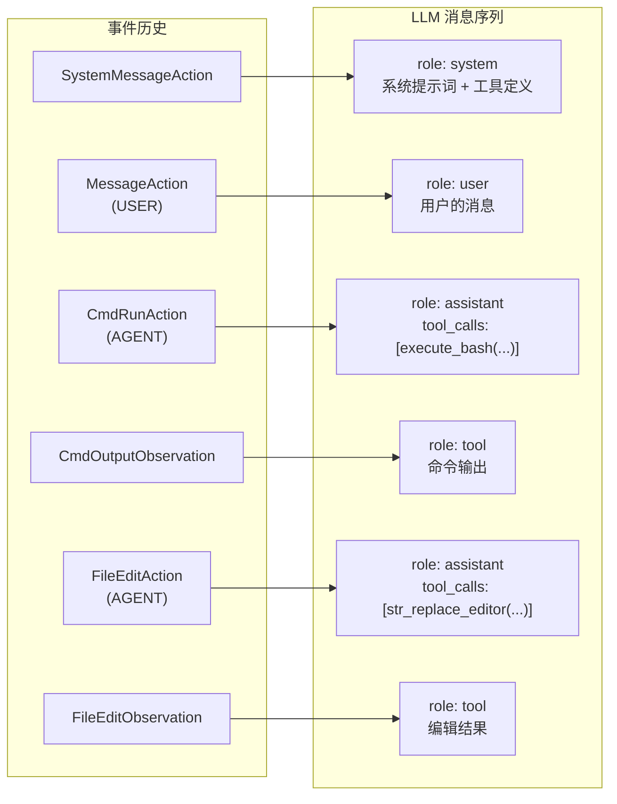
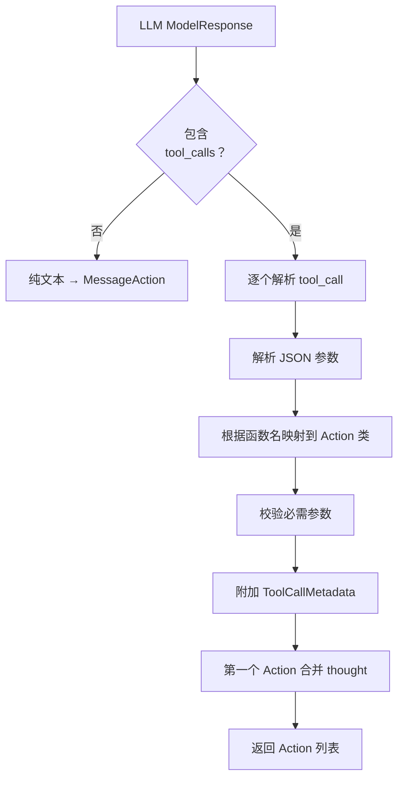

# 第 4 章：CodeActAgent——主力智能体

> 上一章我们看到 Controller 在 `_step()` 中调用 `agent.step(state)` 来获取下一个 Action。Controller 只管调度，不管决策。决策——选择用哪个工具、写什么命令、怎么修改文件——全部发生在 Agent 内部。这一章打开这个黑盒，看 OpenHands 的主力 Agent 是怎么思考和行动的。

---

## 4.1 Agent 注册机制

OpenHands 支持多种 Agent，但它们共享同一个注册接口。基类 Agent 维护一个全局注册表，每种 Agent 在导入时自动注册。

注册表的使用方式很简单：
- 注册：每个 Agent 类用 `Agent.register("agent_name", AgentClass)` 注册自己
- 获取：需要时用 `Agent.get_cls("agent_name")` 拿到类
- 实例化：`agent = AgentClass(config=agent_config, llm_registry=registry)`

当前注册的 6 种 Agent：

| Agent 名称 | 类 | 核心能力 |
|-----------|-----|---------|
| **CodeActAgent** | `CodeActAgent` | 全能——命令执行、文件编辑、Python、浏览器 |
| BrowsingAgent | `BrowsingAgent` | 网页浏览与交互 |
| VisualBrowsingAgent | `VisualBrowsingAgent` | 带视觉能力的浏览 |
| ReadOnlyAgent | `ReadOnlyAgent` | 只读——搜索和查看文件 |
| LOCAgent | `LOCAgent` | 代码行数分析 |
| DummyAgent | `DummyAgent` | 测试用空 Agent |

其中 **CodeActAgent 是默认 Agent**，也是绝大多数场景下使用的。本章聚焦于它。

---

## 4.2 step()：一步的五个阶段

CodeActAgent 的 `step(state)` 方法是整个决策过程的入口。它接收当前状态（包含对话历史），返回一个 Action。



逐步解说：

### 第一阶段：检查待处理队列

LLM 的一次回复可能包含**多个工具调用**——比如同时读两个文件。这些调用被解析为多个 Action，但 `step()` 每次只返回一个。剩余的 Action 被放入 `pending_actions` 队列。下次 Controller 调用 `step()` 时，直接从队列中取出，不再调用 LLM。

### 第二阶段：退出检测

如果用户最近一条消息是 `/exit`，Agent 直接返回 AgentFinishAction，不调用 LLM。

### 第三阶段：压缩历史

对话历史可能非常长——几十上百个事件。直接把所有事件发给 LLM 会超出上下文窗口限制。Agent 通过 **Condenser**（历史压缩器）对历史进行压缩。

Condenser 返回两种可能的结果：
- **View**：压缩后的事件列表 + 被遗忘的事件 ID 集合。Agent 用这个压缩后的列表继续后续步骤
- **Condensation**：压缩操作本身就是一个 Action（比如需要调用 LLM 来做摘要）。Agent 直接返回这个 Action，本轮不调用 LLM

压缩策略有多种实现，详见第 7 章。

### 第四阶段：构建消息序列并调用 LLM

这是最核心的一步。Agent 需要将压缩后的事件历史转换为 LLM 能理解的消息格式，连同可用工具的定义一起发送给 LLM。

消息构建由 ConversationMemory 完成（详见 4.4 节），LLM 调用由 LLM 模块完成（详见第 5 章）。

### 第五阶段：解析 LLM 响应

LLM 返回的 ModelResponse 中可能包含：
- 纯文本回复（没有工具调用）
- 一个或多个工具调用（function calls）
- 思考内容（thought）+ 工具调用

这些都需要被解析成对应的 Action 对象。解析过程详见 4.5 节。

---

## 4.3 工具箱：Agent 能做什么

CodeActAgent 的能力完全通过**工具**（Tools）来定义。每个工具就是一个 LLM 函数调用的 schema——告诉 LLM"你可以调用这个函数，参数是什么，用来干什么"。

工具的注册是**按配置启用**的。不是所有工具都默认开启：

| 工具 | 配置开关 | 功能 | 对应 Action |
|------|---------|------|------------|
| Bash 执行器 | `enable_cmd` | 在终端执行 Shell 命令 | `CmdRunAction` |
| Think | `enable_think` | Agent 内部推理（不执行任何操作） | `AgentThinkAction` |
| Finish | `enable_finish` | 宣告任务完成 | `AgentFinishAction` |
| 请求压缩 | `enable_condensation_request` | 请求压缩对话历史 | `CondensationRequestAction` |
| 浏览器 | `enable_browsing` | 控制浏览器访问网页 | `BrowseInteractiveAction` |
| IPython | `enable_jupyter` | 在 Jupyter 中执行 Python 代码 | `IPythonRunCellAction` |
| 任务追踪器 | `enable_plan_mode` | 创建和更新任务清单 | `TaskTrackingAction` |
| LLM 编辑器 | `enable_llm_editor` | 用 LLM 辅助编辑文件 | `FileEditAction` |
| 字符串替换编辑器 | `enable_editor` | 精确替换文件中的字符串 | `FileReadAction` / `FileEditAction` |

字符串替换编辑器和 LLM 编辑器是互斥的——如果启用了 LLM 编辑器，字符串替换编辑器就不加载。

每个工具以 `ChatCompletionToolParam` 格式定义（这是 OpenAI 函数调用规范的标准格式），包含：
- **name**：函数名（如 `"execute_bash"`）
- **description**：功能描述（LLM 靠这个决定什么时候用这个工具）
- **parameters**：参数 schema（JSON Schema 格式）

---

## 4.4 消息构建：从事件历史到 LLM 输入

LLM 不理解 OpenHands 的 Event 对象。它只接受一种格式：**消息列表**（messages）。ConversationMemory 负责这个转换。

### 转换规则

ConversationMemory 遍历压缩后的事件历史，将每个事件转换为一条或多条 LLM 消息：



不同事件类型的转换方式：

| 事件类型 | LLM 消息角色 | 内容 |
|---------|------------|------|
| `SystemMessageAction` | `system` | 系统提示词（Agent 的角色定义 + 可用工具） |
| `MessageAction`（来自 USER） | `user` | 用户说的话 |
| `MessageAction`（来自 AGENT） | `assistant` | Agent 的回复文本 |
| 带 tool_call_metadata 的 Action | `assistant` | 包含 `tool_calls` 字段的结构化消息 |
| 对应的 Observation | `tool` | 工具执行结果，通过 `tool_call_id` 与 Action 关联 |

### 工具调用的配对机制

这里有一个重要细节：**LLM 的函数调用格式要求 Action 和 Observation 严格配对。**

当 Agent 发出一个带函数调用的 Action 时，ConversationMemory 不会立刻把它加入消息列表。它会暂存在 `pending_tool_call_action_messages` 中，等对应的 Observation 到来后（通过 `tool_call_id` 匹配），才把 Action 消息和 Observation 消息一起加入列表。

这保证了 LLM 看到的消息序列总是**完整的请求-响应对**——不会出现"调用了工具但没有结果"的悬空消息。

### 系统提示词

消息序列的第一条总是系统提示词。CodeActAgent 的系统提示词用 Jinja2 模板定义，包含以下关键内容：

- **角色定义**：你是一个能执行代码、编辑文件、浏览网页的 AI 助手
- **效率准则**：合并多个操作、用 grep 而不是逐行读、避免创建多个文件版本
- **文件系统指南**：如何处理大文件、如何编辑、如何管理变更
- **代码质量**：写干净的代码、不留调试代码
- **版本控制**：Git 操作的注意事项
- **问题解决工作流**：先理解问题 → 分析代码 → 制定方案 → 执行 → 验证
- **安全评估**：如何评估操作的风险等级

---

## 4.5 响应解析：从 LLM 回复到 Action

LLM 返回一个 ModelResponse 后，CodeActAgent 调用 `response_to_actions()` 将其转换为 Action 列表。

### 解析流程



### 工具名到 Action 的映射

核心映射表：

| LLM 调用的函数名 | 生成的 Action 类型 | 关键参数 |
|-----------------|-------------------|---------|
| `execute_bash` | `CmdRunAction` | command, is_input, timeout |
| `execute_ipython_cell` | `IPythonRunCellAction` | code |
| `browser` | `BrowseInteractiveAction` | browser_actions (Python 代码) |
| `str_replace_editor` (command=view) | `FileReadAction` | path, view_range |
| `str_replace_editor` (其他 command) | `FileEditAction` | path, old_str, new_str 等 |
| `edit_file` | `FileEditAction` | path, content, start, end |
| `think` | `AgentThinkAction` | thought |
| `finish` | `AgentFinishAction` | message |
| `request_condensation` | `CondensationRequestAction` | 无参数 |
| MCP 工具名 | `MCPAction` | 动态参数 |

注意 `str_replace_editor` 是一个**多命令工具**——它的 `command` 参数决定实际操作是查看文件（生成 FileReadAction）还是编辑文件（生成 FileEditAction）。

### ToolCallMetadata

每个解析出的 Action 都会附加一个 `ToolCallMetadata`，记录：

| 字段 | 含义 |
|------|------|
| `tool_call_id` | LLM 生成的唯一调用 ID |
| `function_name` | 被调用的工具名 |
| `model_response` | LLM 的原始响应（用于后续消息构建） |
| `total_calls_in_response` | 本次响应中的总调用数 |

这个元数据在后续的消息构建（4.4 节）中至关重要——ConversationMemory 靠 `tool_call_id` 来配对 Action 和 Observation，靠 `model_response` 来还原 LLM 当时的回复。

### Thought（思考）的处理

LLM 的回复可能同时包含**文本内容**和**工具调用**。文本内容通常是 Agent 的"思考"——比如"我先看看文件结构，然后再修改"。

这段思考会被提取出来，合并到**第一个 Action** 的 `thought` 字段中。这样在 UI 上，用户可以看到 Agent 在执行操作之前的推理过程。

---

## 4.6 完整的调用路径

把本章内容串联成一个完整的调用路径：

```
openhands/agenthub/codeact_agent/codeact_agent.py::step(state)
  — 检查 pending_actions → 有则直接返回
  — 检查 /exit → 是则返回 AgentFinishAction
  — 压缩历史
    → condenser.condensed_history(state) → View(events, forgotten_ids)
  — 构建消息
    → _get_messages(condensed_history, initial_user_message, forgotten_ids)
      → conversation_memory.process_events(...)
        — 遍历事件，按类型转换为 Message 对象
        — 配对 tool_call Action 和 Observation
        — 输出：list[Message]
  — 调用 LLM
    → llm.completion(messages=messages, tools=tools)
    — 输出：ModelResponse
  — 解析响应
    → response_to_actions(response)
      → codeact_function_calling.response_to_actions(response, mcp_tool_names)
        — 解析 tool_calls JSON
        — 映射函数名到 Action 类
        — 校验参数、设置元数据
        — 输出：list[Action]
  — 第一个 Action 返回，其余入 pending_actions 队列
```

---

## 4.7 Agent 配置的影响

CodeActAgent 的行为高度可配置。以下配置项直接影响 Agent 的能力和行为：

| 配置项 | 默认值 | 影响 |
|--------|--------|------|
| `enable_cmd` | True | 是否能执行 Shell 命令 |
| `enable_jupyter` | True | 是否能执行 Python 代码 |
| `enable_browsing` | True | 是否能浏览网页 |
| `enable_editor` | True | 是否能编辑文件 |
| `enable_think` | True | 是否能进行内部思考 |
| `enable_plan_mode` | False | 是否启用任务追踪 |
| `enable_llm_editor` | False | 是否用 LLM 辅助编辑（替代精确替换） |
| `enable_stuck_detection` | True | 是否检测循环卡死 |
| `enable_history_truncation` | True | 是否在上下文溢出时自动压缩 |
| `confirmation_mode` | False | 是否需要用户确认高风险操作 |
| `cli_mode` | False | 是否在命令行模式运行（影响确认流程） |

禁用某个工具不只是少了一个选项——LLM 不会"看到"这个工具的 schema，因此根本不会尝试调用它。这是一种**能力裁剪**的设计——在某些受限场景（如只读审计），可以创建一个只能查看不能修改的 Agent。

---

到此，我们已经理解了 Agent 如何决策、有什么工具、怎么解析 LLM 的回复。但 Agent 的核心能力依赖于 LLM——消息是怎么发给 LLM 的？多种模型是怎么适配的？函数调用格式是怎么转换的？这就是下一章的内容。

---

### 质检报告

**讲解节奏**
- [x] 先讲 Agent 注册机制（全局视角）→ step 五阶段 → 工具箱 → 消息构建 → 响应解析

**周边知识**
- [x] Function Calling 概念在序章已引入，本章展开其在 CodeActAgent 中的具体应用
- [x] 工具配对机制解释了为什么需要 pending_tool_call_action_messages

**讲透了吗**
- [x] step() 五个阶段完整拆解
- [x] 消息构建的配对机制详细说明
- [x] 工具名→Action 的映射表完整
- [x] Condenser 标注"详见第 7 章"

**代码纪律**
- [x] 全章代码片段 0 处
- [x] 使用流程图 + 表格 + 调用路径替代

**流程图准确性**
- [x] step() 流程基于 codeact_agent.py 的 step() 方法确认
- [x] 消息转换图基于 conversation_memory.py 的 process_events() 确认
- [x] 响应解析图基于 function_calling.py 的 response_to_actions() 确认

**过渡自然吗**
- [x] 章头衔接 Controller 的 agent.step() 调用
- [x] 章尾引出 LLM 集成
- [x] 各节逻辑递进

**准确吗**
- [x] 9 种工具与源码 _get_tools() 一致
- [x] 映射表与 function_calling.py 一致
- [x] 未确认内容无

**读得下去吗**
- [x] 工具配对机制有直觉解释
- [x] 每张图有文字讲解

**勘误建议**
- 无
