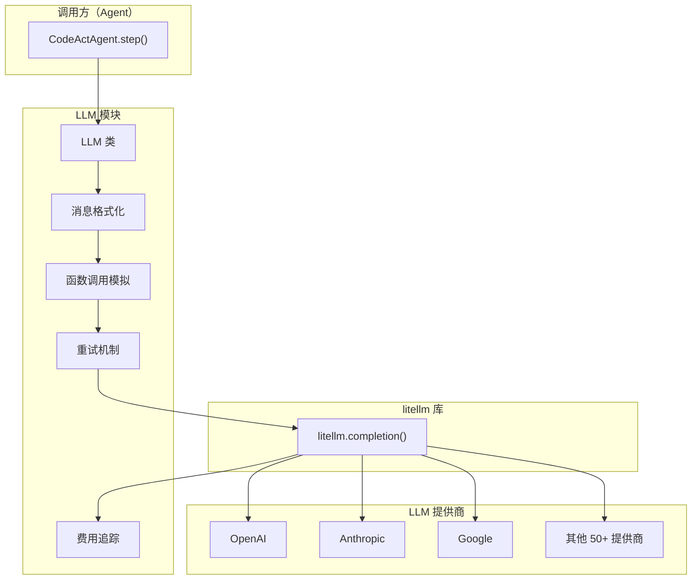
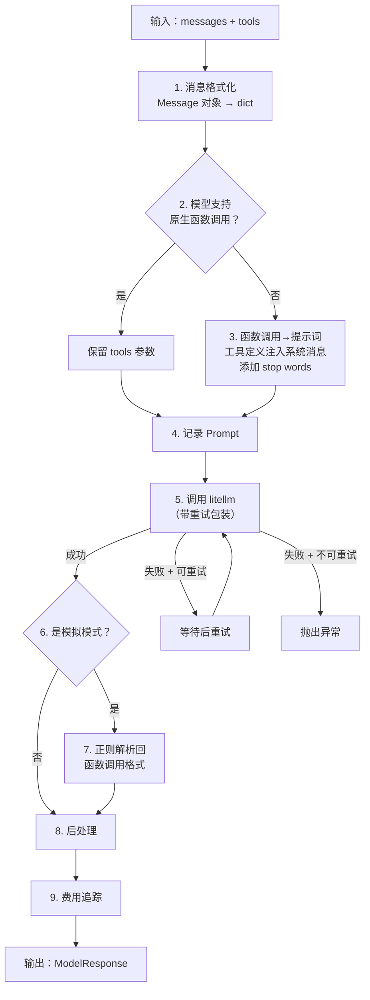

# 第 5 章：LLM 集成——与大模型对话

> 上一章我们看到 CodeActAgent 在 `step()` 中调用 `llm.completion(messages, tools)` 来获取 LLM 的决策。这一次调用看似简单，背后却隐藏着大量的复杂性——不同的模型提供商有不同的 API 格式，有些模型不支持函数调用，网络请求会失败需要重试，每次调用都要跟踪费用……LLM 模块把这些复杂性全部封装起来，对上层提供统一的接口。

---

## 5.1 要解决什么问题

OpenHands 需要支持 50+ 种 LLM——OpenAI 的 GPT 系列、Anthropic 的 Claude 系列、Google 的 Gemini 系列、DeepSeek、Qwen、Mistral，以及各种本地模型。这些模型在以下方面存在差异：

| 差异点 | 示例 |
|--------|------|
| API 格式 | OpenAI 格式 vs Anthropic 格式 vs Google 格式 |
| 函数调用支持 | GPT-4o 原生支持；某些开源模型完全不支持 |
| 参数支持 | 有些模型不支持 temperature；有些不支持 stop words |
| 推理控制 | o3 支持 reasoning_effort；普通模型不支持 |
| 缓存机制 | Claude 支持 prompt caching；其他模型可能不支持 |
| 视觉能力 | GPT-4o 支持图片输入；纯文本模型不支持 |
| 费用结构 | 不同模型的 token 单价差异巨大 |

如果每种模型都写一套适配代码，维护成本不可接受。OpenHands 的解法是：**用 litellm 做基础适配，在其上加一层特性检测和格式转换。**

---

## 5.2 整体架构

LLM 模块的架构可以分为三层：



**litellm**（外部库）负责底层的 API 格式转换——把统一的 OpenAI 格式调用翻译成各提供商的原生格式。**LLM 类**负责更高层的逻辑——特性检测、函数调用模拟、重试、费用追踪。

---

## 5.3 一次 LLM 调用的完整流程

当 Agent 调用 `llm.completion(messages=messages, tools=tools)` 时，数据经历以下处理：



逐步解说：

### 第 1 步：消息格式化

Agent 传入的是 Message 对象列表。LLM 类需要把它们转为 dict 格式（litellm 要求的输入格式）。

在转换过程中，LLM 类会根据当前模型的能力设置序列化标志：
- 如果模型支持 prompt caching → 启用缓存标记
- 如果模型支持视觉 → 保留图片 URL
- 如果模型支持函数调用 → 保留 tool_calls 字段
- 某些特定模型（如 DeepSeek）需要强制字符串序列化

### 第 2-3 步：函数调用适配

这是 LLM 模块最精巧的设计之一。

**问题：** 函数调用（Function Calling）是 Agent 与工具交互的核心方式。但并非所有 LLM 都原生支持它。原生支持的模型（如 GPT-4o、Claude 3.5）接收结构化的 `tools` 参数，返回结构化的 `tool_calls`。不支持的模型只能接收和返回纯文本。

**解法：对不支持函数调用的模型，OpenHands 用"提示词注入 + 正则解析"来模拟。**

具体做法分为发送和接收两个方向：

**发送方向（消息→LLM）：**
- 将工具定义转换为文本描述，注入到系统提示词中
- 告诉 LLM 用特定格式输出工具调用：`<function=工具名>` + `<parameter=参数名>值</parameter>` + `</function>`
- 设置 stop word 为 `</function`，让 LLM 在输出完一个函数调用后停止
- 可选地注入一个"示例"（in-context learning example），教 LLM 正确的格式

**接收方向（LLM→响应）：**
- 用正则表达式匹配 LLM 输出中的 `<function=...>...</function>` 模式
- 解析出函数名和参数
- 将其转换回标准的 tool_calls 格式

这种"模拟"方式不如原生函数调用精确——LLM 可能生成格式不完全正确的输出，需要额外的修复逻辑（比如修补不完整的 `</function>` 标签，规范化畸形的参数标签）。但它让 OpenHands 能够支持任何纯文本 LLM，大大扩展了兼容范围。

### 第 4-5 步：调用 litellm

实际的 API 调用通过 litellm 库发起。litellm 负责将统一的 OpenAI 格式请求翻译成各提供商的原生格式。

调用被包裹在重试装饰器中。遇到以下错误时会自动重试：
- 网络连接错误
- 频率限制（Rate Limit）
- 服务不可用
- 网关错误
- 超时
- 内部服务器错误
- LLM 无响应（空回复）

重试采用**指数退避**策略——第一次等 8 秒，第二次等 16 秒，依次翻倍，最长等 64 秒。默认最多重试 5 次。

一个有趣的细节：如果重试原因是 LLM 返回了空响应，且当前 temperature 为 0，重试时会临时将 temperature 调为 1.0——通过引入随机性来避免同一个输入持续产生空输出。

### 第 6-7 步：模拟模式的响应恢复

如果之前用了模拟函数调用（第 3 步），此时需要将 LLM 返回的纯文本响应解析回函数调用格式。这样上层（Agent）无需关心底层模型是否原生支持函数调用——它始终看到统一的 tool_calls 格式。

### 第 8-9 步：后处理与费用追踪

调用完成后，LLM 类从响应中提取费用和 token 用量信息：

| 追踪指标 | 来源 | 用途 |
|---------|------|------|
| 费用（美元） | litellm 费用计算或自定义 token 单价 | 预算控制 |
| Prompt tokens | response.usage | 上下文窗口监控 |
| Completion tokens | response.usage | 输出量统计 |
| Cache read tokens | prompt_tokens_details | 缓存命中率 |
| Cache write tokens | model_extra（Anthropic 专有） | 缓存效率 |
| 响应延迟 | 调用前后时间差 | 性能监控 |

所有这些指标被记录到 Metrics 对象中，供 Controller 的预算控制标志使用。

---

## 5.4 模型特性检测

OpenHands 不是对每个模型名硬编码支持情况，而是维护一套**模式匹配规则**。每个特性定义一组模型名称模式（支持通配符），运行时用模式匹配来检测当前模型是否支持某特性。

主要特性维度：

| 特性 | 含义 | 支持的模型示例 |
|------|------|-------------|
| 原生函数调用 | 模型 API 直接支持 tools 参数 | claude-3.5-*、gpt-4o*、gemini-2.5-* |
| 推理控制 | 支持 reasoning_effort 参数 | o1、o3*、o4-mini*、claude-sonnet-4-5* |
| Prompt 缓存 | 支持缓存提示词前缀 | claude-3.7-*、claude-3.5-* |
| Stop words | 支持自定义停止词 | 大多数模型（除 o1*、grok-4* 等） |
| 视觉输入 | 支持图片作为输入 | gpt-4o*、claude-3.5-*、gemini-* |

检测流程：模型名先**规范化**（去掉提供商前缀、转小写、去掉 -gguf 后缀），然后与模式列表匹配。这意味着 `openrouter/anthropic/claude-3.5-sonnet` 和 `claude-3.5-sonnet` 会匹配到同一套规则。

---

## 5.5 模型特有的参数调整

不同模型对参数有不同的要求。LLM 类在初始化时会根据模型做针对性调整：

| 模型类型 | 调整 | 原因 |
|---------|------|------|
| 推理模型（o1/o3） | 移除 temperature 和 top_p | 这些模型不支持采样参数 |
| Claude | 不能同时设 temperature 和 top_p | API 限制 |
| Azure | 用 max_tokens 替代 max_completion_tokens | Azure API 版本差异 |
| Gemini | 将 reasoning_effort 映射为 thinking budget | API 格式不同 |
| HuggingFace | top_p 从 1.0 调为 0.9 | 避免生成问题 |
| 本地模型 | 费用视为 0 | 不产生 API 费用 |

这些调整在 LLM 对象创建时就完成了，后续每次调用都自动应用，对上层透明。

---

## 5.6 调用路径总结

```
CodeActAgent.step()
  → llm.completion(messages, tools, extra_body)
    → LLM.wrapper()
      — 1. format_messages_for_llm(messages) → list[dict]
      — 2. 检测模型是否支持原生函数调用
      — 3. 若不支持：convert_fncall_messages_to_non_fncall_messages()
           — 工具定义 → 系统提示词文本
           — tool_calls → 文本格式
           — 设置 stop_words = ['</function']
      — 4. 记录 prompt 日志
      — 5. litellm.completion(**kwargs)
           — 自动重试（指数退避，最多 5 次）
           — 空响应时调高 temperature
      — 6. 若是模拟模式：convert_non_fncall_messages_to_fncall_messages()
           — 正则解析 <function=...> 格式
           — 恢复为标准 tool_calls
      — 7. _post_completion()
           — 计算费用
           — 记录 token 用量
           — 记录延迟
      — 输出：ModelResponse
```

---

## 5.7 设计取舍

**为什么用 litellm 而不是直接调各提供商 API？** litellm 提供了统一的 OpenAI 格式接口，覆盖 100+ 提供商。自己维护这些适配代码不现实。代价是引入了一个外部依赖，且偶尔会遇到 litellm 的 bug。

**为什么要模拟函数调用而不是要求模型必须支持？** 因为很多优秀的开源模型不支持原生函数调用，但用提示词模拟可以达到足够好的效果。这大大扩展了 OpenHands 的适用范围。代价是模拟模式的准确性不如原生模式。

**为什么用模式匹配而不是查询 API？** 因为很多提供商的 API 不提供模型能力查询接口。模式匹配虽然需要手动维护，但速度快且可预测。

---

LLM 返回决策后，Action 通过 EventStream 到达 Runtime。Runtime 负责在安全隔离的环境中执行 Agent 的指令——运行命令、编辑文件、控制浏览器。这个执行环境是怎么搭建的？命令是怎么在 Docker 容器里运行的？这就是下一章的内容。

---

### 质检报告

**讲解节奏**
- [x] 先讲问题（模型差异）→ 架构概览 → 完整调用流程 → 关键子系统 → 设计取舍

**周边知识**
- [x] 函数调用的概念有充分解释（原生 vs 模拟）
- [x] litellm 的定位和作用有说明

**讲透了吗**
- [x] 9 步调用流程每步都有数据变化描述
- [x] 模拟函数调用的双向转换机制讲透
- [x] 特性检测和参数调整机制完整说明

**代码纪律**
- [x] 全章代码片段 0 处
- [x] 使用流程图 + 表格 + 调用路径替代

**流程图准确性**
- [x] 调用流程图基于 wrapper() 实现确认
- [x] 架构图基于实际模块依赖确认

**过渡自然吗**
- [x] 章头衔接 Agent 的 llm.completion() 调用
- [x] 章尾引出 Runtime 执行环境
- [x] 章内各节逻辑递进

**准确吗**
- [x] 重试异常列表与 LLM_RETRY_EXCEPTIONS 一致
- [x] 模型特性模式与 model_features.py 一致

**读得下去吗**
- [x] 模拟函数调用有直觉解释
- [x] 每张图有文字讲解

**勘误建议**
- 无
