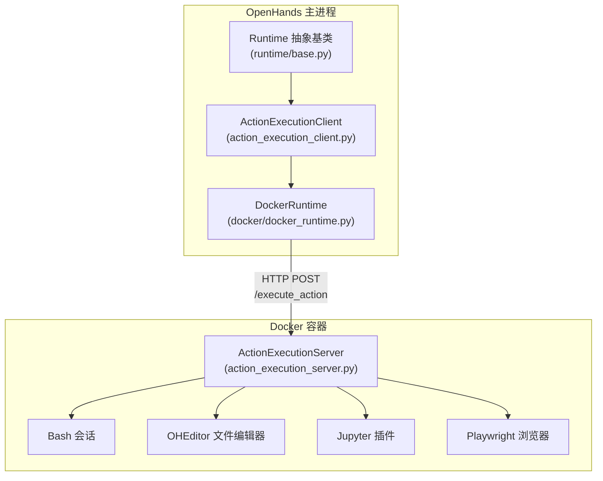
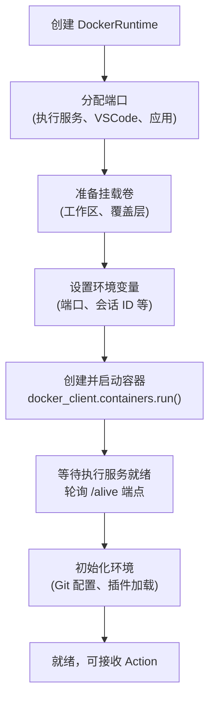

# 第 6 章：运行时——沙箱执行环境

> 前几章我们一路追踪了从用户输入到 LLM 决策的全过程。LLM 做出决策后，产生一个 Action——比如 `CmdRunAction(command="python test.py")`。这个 Action 通过 EventStream 到达 Runtime。Runtime 的职责是：**在一个安全隔离的环境中，把 Action 变成 Observation。** 这一章，我们来看这个执行环境是怎么搭建的、命令是怎么执行的、结果是怎么返回的。

---

## 6.1 为什么需要沙箱

AI Agent 会执行用户指定的任务，但它也可能执行有害操作——删除重要文件、安装恶意软件、泄露敏感数据。即使 Agent 没有恶意，它也可能因为误判而执行破坏性命令。

如果 Agent 直接在用户的本机上执行命令，后果可能不可挽回。

OpenHands 的解法是**沙箱隔离**：所有代码执行都在一个独立的 Docker 容器中进行。容器有自己的文件系统、进程空间和网络。即使 Agent 执行了 `rm -rf /`，影响的也只是容器内部，用户的系统毫发无损。

---

## 6.2 Runtime 的分层架构

Runtime 模块采用**三层架构**：抽象层、客户端层、执行层。



逐层说明：

**Runtime 抽象基类**（`base.py`）：定义了所有 Runtime 实现必须提供的接口——`run()`（执行命令）、`read()`（读文件）、`write()`（写文件）、`edit()`（编辑文件）、`browse()`（浏览网页）等。同时实现了**事件分发逻辑**：从 EventStream 收到 Action 后，调用 `run_action()` 方法根据 Action 类型分派到对应的处理方法。

**ActionExecutionClient**（`action_execution_client.py`）：负责与容器内的执行服务通信。它把 Action 序列化为 JSON，通过 HTTP POST 发送到容器内的 `ActionExecutionServer`，接收响应并反序列化为 Observation。

**DockerRuntime**（`docker_runtime.py`）：继承自 ActionExecutionClient，负责 Docker 容器的**生命周期管理**——创建、启动、停止、销毁容器。

**ActionExecutionServer**（`action_execution_server.py`）：**运行在容器内部**的 FastAPI HTTP 服务。它是实际执行操作的地方——接收 HTTP 请求，在容器内执行命令/读写文件/控制浏览器，返回结果。

---

## 6.3 Docker 容器的生命周期

当一个新的会话开始时，DockerRuntime 会创建并启动一个 Docker 容器。这个过程分为多个步骤：



**端口分配。** 容器需要暴露多个端口：ActionExecutionServer 端口（30000-39999 范围）、VSCode 端口、应用端口。端口分配使用文件锁来避免多个容器抢占同一端口。

**挂载卷。** 用户的工作区目录可以挂载到容器内，这样 Agent 操作的文件就是用户的实际文件。也支持只读覆盖挂载——容器可以读取宿主机的文件，但修改只在容器内生效。

**等待就绪。** 容器启动后，DockerRuntime 会反复轮询 `http://localhost:{port}/alive` 端点，直到 ActionExecutionServer 响应，表示它已经准备好接收请求。

**初始化环境。** 就绪后，DockerRuntime 会执行一系列初始化操作——配置 Git 用户名和邮箱、设置环境变量、加载插件（Jupyter、VSCode 等）。

容器创建参数中有一个关键设置：`init=True`。这使用了 tini 作为 PID 1 进程，负责正确处理信号传递和僵尸进程回收——这是在容器中运行多进程应用的最佳实践。

---

## 6.4 Action 的执行：从 HTTP 请求到结果

当一个可执行的 Action 通过 EventStream 到达 Runtime 时，执行流程如下：

**调用路径：**

```
openhands/runtime/base.py::on_event(event)
  — 判断是 Action → 调用 _handle_action(event)
→ action_execution_client.py::_handle_action(event)
  — 设置超时时间（默认来自 sandbox.timeout 配置）
  — 如果是 MCPAction → 调用 call_tool_mcp()
  — 否则 → 调用 run_action(event)
→ action_execution_client.py::send_action_for_execution(action)
  — 序列化：event_to_dict(action) → JSON
  — 发送：HTTP POST 到 http://localhost:{port}/execute_action
  — 接收：HTTP 响应 JSON
  — 反序列化：observation_from_dict(response) → Observation
  — 设置因果链：observation._cause = action.id
→ _handle_action 将 Observation 放入 EventStream（source=ENVIRONMENT）
```

**容器内部的处理（ActionExecutionServer）：**

```
action_execution_server.py::/execute_action 端点
  — 反序列化：JSON → Action 对象
  — 分派：根据 action.action 类型调用对应方法
    — "run" → 在 Bash 会话中执行命令
    — "read" → 读取文件内容
    — "write" → 写入文件
    — "edit" → 使用 OHEditor 编辑文件
    — "run_ipython" → 在 Jupyter 中执行 Python
    — "browse" / "browse_interactive" → 控制 Playwright 浏览器
  — 序列化：Observation → JSON
  — 返回 HTTP 响应
```

每种操作类型的具体处理方式：

### 命令执行（CmdRunAction → CmdOutputObservation）

Bash 命令在容器内的一个持久 Bash 会话中执行。"持久"意味着环境变量和工作目录在多次命令之间保持——Agent 先 `cd /project`，再 `ls`，第二条命令会在 `/project` 目录下执行。

Observation 中包含命令的完整输出和退出码。

### 文件读取（FileReadAction → FileReadObservation）

支持两种读取模式：
- **默认模式**：直接读取文件，支持指定行范围
- **OHEditor 模式**：通过 OHEditor（一个项目自带的编辑器工具）读取，会显示行号

对于图片、PDF、视频等二进制文件，会进行 Base64 编码后返回。

### 文件编辑（FileEditAction → FileEditObservation）

使用 OHEditor 执行编辑操作。支持的编辑命令包括：
- `view`：查看文件（带行号）
- `create`：创建新文件
- `str_replace`：在文件中查找并替换字符串
- `insert`：在指定行后插入内容
- `undo_edit`：撤销上一次编辑

Observation 中包含编辑结果文本，以及编辑前后的内容差异（diff）。

编辑完成后还会保留文件的原始权限（用户、组、读写执行权限），避免 Agent 的编辑操作意外改变文件属性。

### Python 执行（IPythonRunCellAction → IPythonRunCellObservation）

通过 Jupyter 插件执行 Python 代码。Jupyter 以内核的形式运行在容器内，支持有状态的 Python 会话——变量、导入、对象在多次执行之间保持。

### 浏览器操作（BrowseInteractiveAction → BrowserOutputObservation）

通过 Playwright 控制无头浏览器。Agent 发送 Python 代码形式的浏览器操作指令（如 `page.goto("https://example.com")`），ActionExecutionServer 在浏览器环境中执行并返回页面状态。

---

## 6.5 多种 Runtime 实现

Docker 不是唯一的 Runtime 选项。OpenHands 的 Runtime 抽象允许插入不同的后端实现：

| Runtime | 使用场景 | 隔离性 | 特点 |
|---------|---------|--------|------|
| **Docker** | 默认选项，本地开发 | 强 | 容器级隔离，端口映射 |
| **Remote** | 云部署 | 强 | 连接远程服务器上的执行环境 |
| **Kubernetes** | 大规模部署 | 强 | 在 K8s Pod 中运行 |
| **Local** | 开发调试 | 无 | 直接在本机执行（不推荐生产使用） |
| **CLI** | 命令行模式 | 无 | 为 CLI 交互优化 |

所有实现都继承自同一个 Runtime 基类，对上层（Controller、EventStream）完全透明。切换 Runtime 只需改一个配置项：

```
runtime: "docker"  →  runtime: "kubernetes"
```

这种可插拔设计得益于第 2 章介绍的事件驱动架构——Controller 不直接调用 Runtime 的方法，而是通过 EventStream 传递 Action。Runtime 作为 EventStream 的订阅者自行处理。换 Runtime 实现，只需要换订阅者。

---

## 6.6 从 Action 到 Observation 的数据变化总结

| 阶段 | 数据形态 | 所在位置 |
|------|---------|---------|
| Agent 返回 | Action 对象（如 CmdRunAction） | 主进程 |
| Controller 发送 | EventStream 中的事件 | 主进程 |
| Runtime 接收 | Action 对象 | 主进程（Runtime 订阅者线程） |
| 序列化 | JSON 字典 | 主进程 |
| HTTP 传输 | JSON 请求体 | 网络（主进程→容器） |
| 容器接收 | JSON → Action 对象 | 容器内 ActionExecutionServer |
| 执行 | 操作系统层面的命令/文件/浏览器操作 | 容器内 |
| 结果收集 | 字符串/二进制数据 | 容器内 |
| 响应构建 | Observation 对象 → JSON | 容器内 |
| HTTP 返回 | JSON 响应体 | 网络（容器→主进程） |
| 反序列化 | JSON → Observation 对象 | 主进程 |
| 设置因果链 | observation._cause = action.id | 主进程 |
| 发送回 EventStream | Observation 事件（source=ENVIRONMENT） | 主进程 |

一个 Action 从主进程出发，跨越进程边界和容器边界，在容器内执行后，结果原路返回。整个往返过程对 Agent 和 Controller 完全透明——它们只看到"发出 Action，收到 Observation"。

---

## 6.7 设计取舍

**为什么用 HTTP 而不是更高效的 IPC？** HTTP 是最通用的协议，不管 Runtime 是本地容器还是远程服务器甚至 Kubernetes Pod，都可以用同一套通信方式。这种统一性的代价是每次操作多一次网络往返（通常 1-5ms），相比 LLM 的推理时间（通常 1-10 秒）可以忽略。

**为什么容器内也跑一个 FastAPI 服务？** 因为需要一个进程来管理容器内的状态（Bash 会话、Jupyter 内核、浏览器实例）。如果每次都启动新进程执行命令，环境状态就会丢失。一个常驻的 HTTP 服务天然适合管理这些有状态的资源。

**为什么 Agent 的文件编辑要还原权限？** 因为一些系统文件（如 Shell 脚本、配置文件）的权限有特定要求。如果 Agent 编辑后权限变了（比如可执行文件变成不可执行），可能导致后续操作失败。这个小细节体现了工程上的周到考量。

---

LLM 负责思考，Runtime 负责执行。但随着对话越来越长，对话历史可能超出 LLM 的上下文窗口。怎么在有限的窗口内保留最重要的信息？这就是下一章——记忆与历史管理——要解决的问题。

---

### 质检报告

**讲解节奏**
- [x] 先讲为什么需要沙箱 → 分层架构 → 容器生命周期 → Action 执行流程 → 多种实现

**周边知识**
- [x] Docker 容器隔离的必要性有解释
- [x] tini 作为 PID 1 的最佳实践有说明

**讲透了吗**
- [x] 容器创建六步流程完整
- [x] Action 执行的调用路径从 on_event 到 HTTP 往返完整
- [x] 五种操作类型各有说明

**代码纪律**
- [x] 全章代码片段 0 处
- [x] 使用架构图 + 流程图 + 调用路径 + 表格替代

**流程图准确性**
- [x] 架构图基于实际类继承关系确认
- [x] 容器生命周期基于 init_container() 确认
- [x] 执行路径基于 send_action_for_execution() 确认

**过渡自然吗**
- [x] 章头衔接 LLM 决策后的 Action 执行
- [x] 章尾引出记忆管理问题
- [x] 各节逻辑递进

**准确吗**
- [x] 5 种 Runtime 实现与 impl/ 目录一致
- [x] 端口范围 30000-39999 与源码一致
- [x] OHEditor 命令列表与 action_execution_server.py 一致

**读得下去吗**
- [x] 沙箱概念有直觉解释
- [x] 每张图有文字讲解

**勘误建议**
- 无
