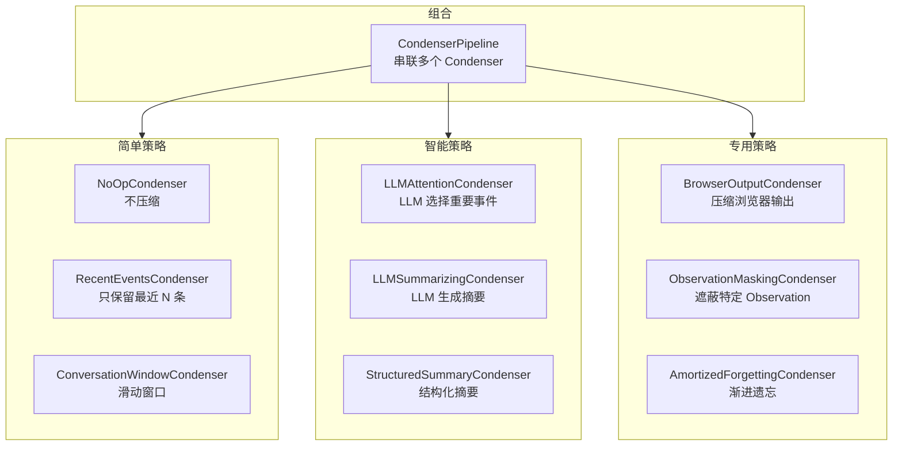
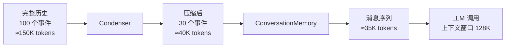

# 第 7 章：记忆与历史管理

> 上一章我们看到 Runtime 如何执行 Agent 的指令并返回结果。每一轮"Action → Observation"都会产生新的事件，对话历史不断增长。但 LLM 有一个硬限制——**上下文窗口**（Context Window），即一次能处理的最大 token 数量。当对话历史超过这个窗口时，Agent 就"记不住"之前发生了什么。如何在有限的窗口内保留最重要的信息，让 Agent 既不遗忘关键上下文，又不被冗余信息淹没？这就是记忆管理系统要解决的问题。

---

## 7.1 问题的本质

假设 LLM 的上下文窗口是 128K token。一个复杂的编程任务可能需要 Agent 执行 50+ 步操作——读取十几个文件、运行多次测试、反复修改代码。每一步的 Action 和 Observation 都会累加到历史中。一个测试输出可能就有几千 token，一个大文件的内容可能占用上万 token。

不压缩，很快就会超出窗口限制。

但简单地截断——只保留最近的 N 条事件——又会丢失关键的上下文。比如用户最初的任务描述、Agent 早期发现的关键信息、之前的失败尝试和教训。

OpenHands 的解法是引入 **Condenser**（历史压缩器）——一个可插拔的模块，负责在保留关键信息的前提下压缩对话历史。

---

## 7.2 Condenser 的架构

### 基本接口

Condenser 的核心方法是 `condensed_history(state)`，输入是当前状态（包含完整事件历史），输出是两种可能之一：

| 返回类型 | 含义 | Agent 的反应 |
|---------|------|------------|
| **View** | 压缩后的事件列表 + 被遗忘的事件 ID 集合 | Agent 用压缩后的列表构建消息，调用 LLM |
| **Condensation** | 一个需要执行的压缩 Action | Agent 直接返回这个 Action，本轮不调用 LLM |

View 是**同步的**——压缩立刻完成，Agent 可以继续工作。Condensation 是**异步的**——需要额外的步骤来完成压缩（比如需要调用 LLM 来生成摘要），Agent 需要等一轮。

### 多种压缩策略

OpenHands 提供了多种 Condenser 实现，适用于不同场景：



逐个说明：

**NoOpCondenser（不压缩）：** 直接返回完整历史。适用于短对话或超大上下文窗口的模型。

**RecentEventsCondenser（保留最近 N 条）：** 最简单的压缩——丢弃最早的事件，只保留最近 N 条。优点是速度极快，缺点是可能丢失早期的重要上下文（如用户的原始任务描述）。

**ConversationWindowCondenser（滑动窗口）：** 类似 RecentEventsCondenser，但以 token 数量而非事件数量为窗口单位。当总 token 数超过阈值时，从头部开始丢弃事件。

**LLMAttentionCondenser（LLM 选择重要事件）：** 调用一个 LLM 来判断哪些事件是"重要的"，只保留被标记为重要的事件。这是一种更智能的压缩——LLM 理解语义，能够判断哪些信息对当前任务仍然相关。代价是每次压缩都需要一次额外的 LLM 调用。

**LLMSummarizingCondenser（LLM 生成摘要）：** 调用 LLM 将旧的事件历史总结为一段简洁的文字摘要。摘要替代原始事件，大幅减少 token 占用。

**StructuredSummaryCondenser（结构化摘要）：** 类似 LLM 摘要，但输出结构化的信息——比如"已完成的步骤"、"遇到的问题"、"待完成的任务"。

**BrowserOutputCondenser（浏览器输出压缩）：** 专门处理浏览器操作产生的大量输出（DOM 树、截图数据等），将其压缩为关键信息。

**ObservationMaskingCondenser（观察遮蔽）：** 把超过一定长度的 Observation 内容替换为简短摘要或标记，避免一个大文件的内容占满整个上下文窗口。

**AmortizedForgettingCondenser（渐进遗忘）：** 不是一次性压缩，而是每隔一定步数渐进地遗忘一部分旧事件。这种方式分散了压缩的开销。

### CondenserPipeline：串联组合

最强大的策略是 **CondenserPipeline**——将多个 Condenser 串联起来，按顺序执行。例如：

```
BrowserOutputCondenser → ObservationMaskingCondenser → LLMSummarizingCondenser
```

先压缩浏览器输出 → 再遮蔽过长的 Observation → 最后用 LLM 做整体摘要。每一步都在前一步的结果上进一步压缩。

这种组合方式让用户可以根据自己的场景灵活配置压缩策略。

---

## 7.3 ConversationMemory：事件到消息的翻译

Condenser 输出的是压缩后的事件列表。但 LLM 不理解 Event 对象——它需要的是**消息列表**（messages）。ConversationMemory 负责这个翻译。

这个组件在第 4 章已经简要提到。这里补充几个关键的设计细节。

### 保护关键消息

在压缩过程中，有些消息**不能被压缩或丢弃**：

| 消息 | 原因 |
|------|------|
| 系统提示词 | LLM 的行为完全依赖它，丢失后 Agent 失去角色定义 |
| 用户最初的任务描述 | Agent 需要始终记得用户想做什么 |
| 最近的 Action-Observation 对 | Agent 需要知道刚刚发生了什么 |

ConversationMemory 在构建消息时会确保这些关键内容始终存在于消息序列中。

### 大内容截断

即使经过 Condenser 压缩，单个 Observation 的内容也可能非常长（比如一个大文件的完整内容）。ConversationMemory 在处理时会根据 `max_message_chars` 配置截断过长的内容，并在截断处标注提示。

### Vision 模式

如果 LLM 支持图像输入（如 GPT-4o），ConversationMemory 会在消息中保留图片 URL。特别是浏览器操作产生的截图和 IPython 执行产生的图表，会以图片形式传给 LLM，让它"看到"执行结果。

---

## 7.4 压缩时机：什么时候触发压缩

Condenser 的调用时机有两种：

**主动触发（每步调用）：** 在 CodeActAgent 的 `step()` 方法中，每次调用 LLM 前都会先调用 `condenser.condensed_history(state)`。如果压缩策略是被动型的（如 NoOp、RecentEvents），它只是快速过滤，几乎没有开销。如果是主动型的（如 LLM 摘要），它会在检测到历史过长时触发压缩。

**上下文溢出恢复：** 当 LLM 调用因上下文窗口溢出而失败时（第 3 章提到），Controller 会发送一个 `CondensationRequestAction`。Agent 在下一步 `step()` 中看到这个 Action 后，会强制执行一次压缩。

---

## 7.5 压缩的数据变化

一次典型的压缩过程中，数据经历的变化：



原始 100 个事件（约 150K tokens）经过 Condenser 压缩为 30 个事件（约 40K tokens），再由 ConversationMemory 转换为消息序列（约 35K tokens），安全地放入 128K 的上下文窗口。

被遗忘的 70 个事件的 ID 被记录在 `forgotten_event_ids` 集合中。这些 ID 的作用是在消息构建时跳过这些事件，同时保留它们在磁盘上的持久化记录——如果需要回溯，仍然可以从 FileStore 中读取完整历史。

---

## 7.6 设计取舍

**为什么不直接增大上下文窗口？** 更大的窗口意味着更高的费用（token 越多越贵）和更慢的推理速度。而且窗口再大也有上限，足够长的任务终究会超出。智能压缩是更可持续的解法。

**为什么提供这么多种 Condenser？** 因为没有万能的压缩策略。简单策略（截断）速度快但可能丢信息；智能策略（LLM 摘要）保留信息好但有额外费用和延迟。不同用户、不同任务、不同预算，适合不同的策略。Pipeline 机制允许用户自由组合。

**为什么被遗忘的事件还要保留在磁盘上？** 因为"遗忘"只是对当前 LLM 调用的优化，不是真正的删除。完整的事件历史对于调试、审计和会话恢复仍然有价值。

---

主干流程到此为止——从用户输入、到事件分发、到控制器调度、到 Agent 决策、到 LLM 推理、到沙箱执行、再到记忆压缩。接下来，我们将视角转向外围：用户与系统交互的入口——服务端和前端。

---

### 质检报告

**讲解节奏**
- [x] 先讲问题（上下文窗口限制）→ Condenser 架构 → 多种策略 → ConversationMemory → 触发时机

**周边知识**
- [x] 上下文窗口概念有解释
- [x] 不同压缩策略的取舍有分析

**讲透了吗**
- [x] 10 种 Condenser 实现逐一说明
- [x] Pipeline 串联机制说明
- [x] 压缩的数据变化用具体数字示例
- [x] 两种触发时机说明

**代码纪律**
- [x] 全章代码片段 0 处
- [x] 使用流程图 + 表格替代

**流程图准确性**
- [x] Condenser 类型图基于 impl/__init__.py 确认
- [x] 数据变化流程基于 step() 中 condensed_history() 调用确认

**过渡自然吗**
- [x] 章头衔接 Runtime 执行后历史增长的问题
- [x] 章尾引出服务端和前端
- [x] 各节逻辑递进

**准确吗**
- [x] 10 种 Condenser 与源码注册表一致
- [x] View 和 Condensation 两种返回类型与源码一致

**读得下去吗**
- [x] 压缩概念有直觉解释
- [x] 用具体数字（100 事件→30 事件→35K tokens）让读者感受量级

**勘误建议**
- 无
