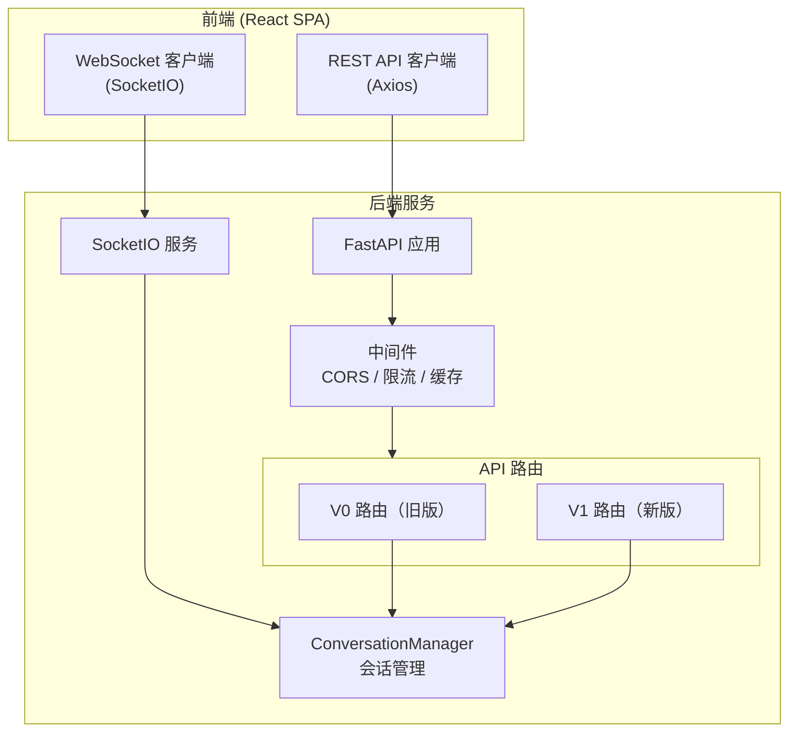
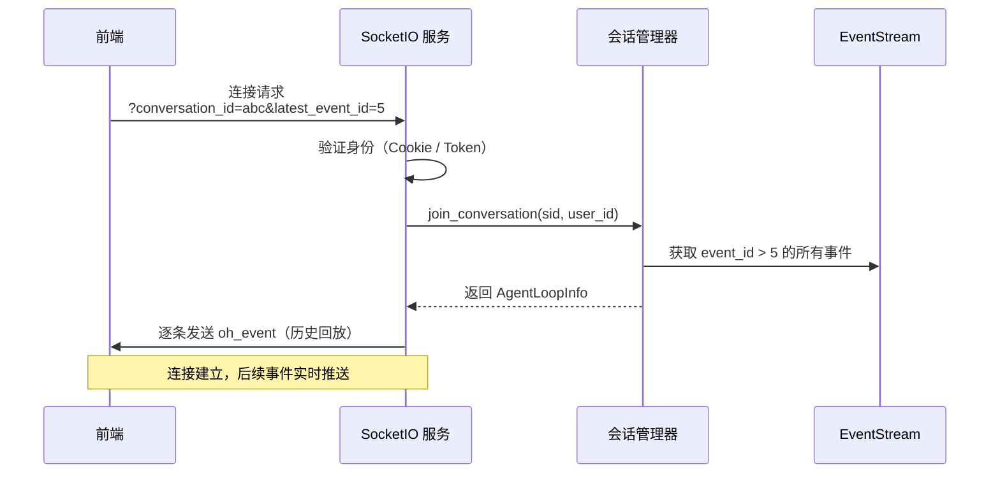
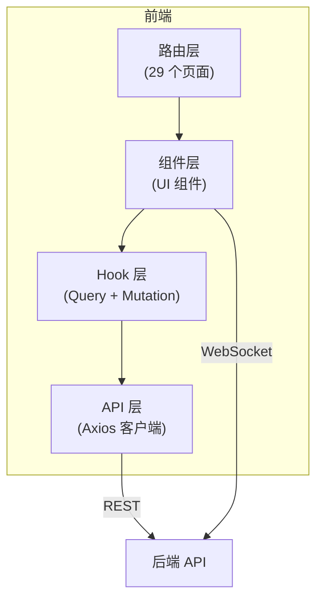

# 第 8 章：服务端与前端——用户界面层

> 前七章我们沿着主干流程——事件系统、控制器、Agent、LLM、运行时、记忆管理——走完了 OpenHands 的核心。但用户不会直接与这些模块交互。用户看到的是一个网页聊天界面或一个命令行终端。这一章讲的是 OpenHands 的"门面"——服务端如何接收请求、前端如何展示信息、以及实时通信是如何实现的。

---

## 8.1 服务端架构概览

OpenHands 的后端服务由两部分组成：**FastAPI HTTP 服务**处理 REST 请求，**SocketIO** 处理 WebSocket 双向通信。



### 关于 V0 和 V1

OpenHands 正在从 V0 架构迁移到 V1 架构。这个迁移截至 2026 年 3 月尚未完成：

| 方面 | V0（旧版） | V1（新版） |
|------|-----------|-----------|
| 入口 | `openhands/server/listen.py` | `openhands/app_server/` |
| 路由 | `openhands/server/routes/` | `openhands/app_server/` 下各 router |
| 会话管理 | ConversationManager | AppConversationService |
| 状态 | 标记为废弃，2026.4 移除 | 推荐使用 |
| API 前缀 | `/api/` | `/api/v1/` |

两套路由目前**同时挂载**在同一个 FastAPI 应用上。前端代码也同时调用两套 API。本章以功能维度讲解，不区分 V0/V1 的实现差异。

---

## 8.2 REST API：前端与后端的约定

服务端暴露的 REST API 按功能分为以下几组：

### 会话管理

| 操作 | 端点 | 说明 |
|------|------|------|
| 创建会话 | `POST /api/conversations` | 返回会话 ID |
| 列出会话 | `GET /api/conversations` | 支持分页、过滤 |
| 获取会话 | `GET /api/conversations/{id}` | 返回会话详情和状态 |
| 删除会话 | `DELETE /api/conversations/{id}` | 清理会话数据 |
| 启动会话 | `POST /api/conversations/{id}/start` | 启动 Agent 循环 |
| 停止会话 | `POST /api/conversations/{id}/stop` | 停止正在执行的 Agent |

### 消息与事件

| 操作 | 端点 | 说明 |
|------|------|------|
| 发送消息 | `POST /api/conversations/{id}/events` | 发送用户消息到会话 |
| 查询事件 | `GET /api/v1/conversation/{id}/events/search` | 搜索会话中的事件 |
| 确认操作 | `POST /api/conversations/{id}/events/respond_to_confirmation` | 用户确认/拒绝高风险操作 |

### 配置与设置

| 操作 | 端点 | 说明 |
|------|------|------|
| 获取设置 | `GET /settings` | 返回用户的 LLM 配置等 |
| 保存设置 | `POST /settings` | 更新设置 |
| 列出模型 | `GET /models` | 返回可用 LLM 列表 |
| 列出 Agent | `GET /agents` | 返回可用 Agent 列表 |
| 管理密钥 | `CRUD /secrets/secrets` | 创建/读取/更新/删除密钥 |

### 文件与 Git

| 操作 | 端点 | 说明 |
|------|------|------|
| 读取文件 | `GET /api/v1/conversations/{id}/file` | 读取会话工作区中的文件 |
| 上传文件 | `POST` (multipart) | 上传文件到会话工作区 |
| 下载会话 | `GET /api/v1/conversations/{id}/download` | 下载整个工作区为 ZIP |
| Git 仓库 | `GET /git/repositories` | 列出已关联的 Git 仓库 |
| Git 分支 | `GET /git/repository/branches` | 列出分支 |

---

## 8.3 WebSocket：实时双向通信

REST API 适合请求-响应模式，但不适合**实时推送**。Agent 的每一步操作——执行命令、编辑文件、发出消息——都需要实时推送给前端，让用户看到进度。这就是 WebSocket 的用武之地。

OpenHands 使用 **SocketIO** 库实现 WebSocket 通信。

### 连接流程



连接时，客户端传入 `latest_event_id`——它已经拥有的最新事件编号。服务端从 EventStream 中取出所有编号大于它的事件，**逐条回放**给客户端。这保证了客户端即使短暂断连，重连后也不会丢失任何事件。

### 核心事件

| 事件名 | 方向 | 含义 |
|--------|------|------|
| `oh_event` | 服务端→客户端 | 推送新事件（Agent 的 Action、Runtime 的 Observation、状态变更等） |
| `oh_user_action` | 客户端→服务端 | 用户发送操作（消息、确认、停止等） |
| `connect` | 客户端→服务端 | 建立连接 + 事件回放 |
| `disconnect` | 客户端→服务端 | 断开连接 |

这个设计非常简洁——只有两个核心事件：`oh_event`（下行推送）和 `oh_user_action`（上行操作）。所有的事件类型（Action 或 Observation 的具体类型）都编码在事件的 JSON 负载中，由前端根据类型字段做不同的展示。

---

## 8.4 前端架构

前端是一个 **React 单页应用**（SPA），用 TypeScript 编写，使用 TanStack Query（React Query）管理数据获取和缓存。

### 分层结构



**路由层**：定义页面结构——对话页、设置页、登录页等。

**组件层**：可复用的 UI 组件——聊天窗口、代码编辑器预览、终端输出、文件浏览器等。

**Hook 层**：所有数据获取都通过 TanStack Query 的自定义 Hook 完成。分为两类：
- **Query Hook**（66 个）：用于读取数据，如 `useConversationHistory`、`useGitRepositories`
- **Mutation Hook**（47 个）：用于修改数据，如 `useCreateConversation`、`useDeleteConversation`

**API 层**：底层的 HTTP 客户端方法，不直接从组件调用——必须通过 Hook 层。

### 架构规则

前端有一条严格的架构规则：**UI 组件 → TanStack Query Hook → API 层 → 后端端点**。

组件不能直接调用 API 层的方法——必须通过 Hook。这样做的好处是 TanStack Query 自动处理缓存、去重、后台刷新和乐观更新。

---

## 8.5 中间件

服务端使用三个中间件：

| 中间件 | 功能 |
|--------|------|
| **LocalhostCORSMiddleware** | 允许 localhost 的跨域请求（开发环境） |
| **CacheControlMiddleware** | 设置静态资源的缓存策略 |
| **RateLimitMiddleware** | 限流——默认 10 请求/秒 |

限流保护系统不被恶意或意外的大量请求压垮。10 请求/秒对于单用户的 AI Agent 场景已经绰绰有余。

---

## 8.6 会话管理器

ConversationManager 是服务端的核心组件之一，负责会话的生命周期管理。它有两种实现：

| 实现 | 场景 |
|------|------|
| StandaloneConversationManager | 单服务器部署，一个进程管理所有会话 |
| DockerNestedConversationManager | 每个会话在独立的 Docker 容器中运行 |

会话管理器的核心职责：
- 创建和销毁会话
- 将用户消息路由到对应的 EventStream
- 管理 Agent 循环的启动和停止
- 处理 WebSocket 连接的加入和离开

---

## 8.7 整体请求流程

把本章内容串联起来，一条用户消息从浏览器到 Agent 的完整路径：

```
用户在浏览器输入消息 → 点击发送
→ 前端 Mutation Hook (useNewConversationCommand)
  → API 客户端 (sendMessage)
    → HTTP POST /api/conversations/{id}/events
      → FastAPI 路由处理
        → ConversationManager.send_event_to_conversation()
          → EventStream.add_event(MessageAction, source=USER)
            → 广播给 Controller → Agent.step() → ...（进入核心流程）

Agent 产生事件 → EventStream 广播
→ Server 订阅者收到事件
  → SocketIO.emit('oh_event', event_data)
    → WebSocket 推送给前端
      → React 组件更新 UI
```

上行（用户→Agent）走 REST API，下行（Agent→用户）走 WebSocket。这种混合模式结合了 REST 的简洁可靠和 WebSocket 的实时推送能力。

---

安全不只是一个独立的模块——它贯穿在 Agent 的每一步操作中。当 Agent 要删除一个文件时，谁来判断这个操作是否安全？确认模式是怎么工作的？密钥是怎么被保护的？这就是下一章的内容。

---

### 质检报告

**讲解节奏**
- [x] 先讲服务端整体架构 → REST API → WebSocket → 前端 → 中间件 → 请求全流程

**周边知识**
- [x] V0/V1 迁移状态有说明
- [x] WebSocket vs REST 的适用场景有解释

**讲透了吗**
- [x] REST API 主要端点按功能分组列出
- [x] WebSocket 连接流程和核心事件完整
- [x] 前端四层架构和规则说明
- [x] 请求全流程串联

**代码纪律**
- [x] 全章代码片段 0 处
- [x] 使用流程图 + 序列图 + 表格替代

**流程图准确性**
- [x] 架构图基于 listen.py 和 app.py 确认
- [x] WebSocket 连接流程基于 listen_socket.py 的 connect 事件处理确认

**过渡自然吗**
- [x] 章头衔接前七章核心流程
- [x] 章尾引出安全体系
- [x] 各节逻辑递进

**准确吗**
- [x] 路由文件列表与实际目录一致
- [x] WebSocket 事件名与 listen_socket.py 一致
- [x] 前端目录结构与实际一致

**读得下去吗**
- [x] V0/V1 区别有清晰对比
- [x] 每张图有文字讲解

**勘误建议**
- 无
