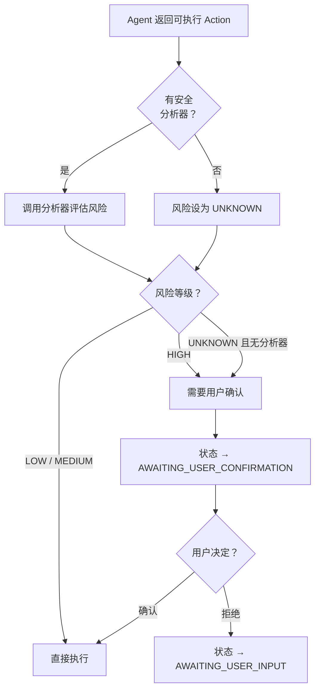
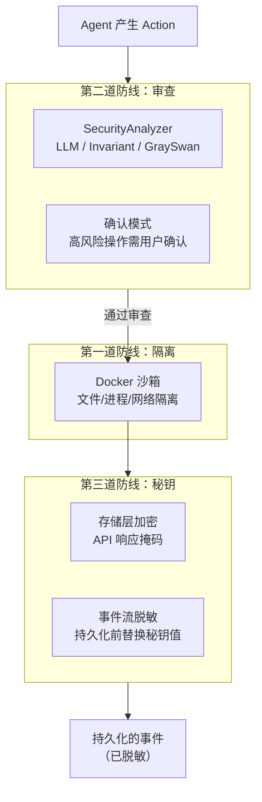

# 第 9 章：安全体系

> 上一章我们看到了用户与系统交互的前门。但 AI Agent 拥有执行命令、编辑文件、访问网络的能力——这些能力如果不加约束，可能造成严重后果。一条 `rm -rf /` 就能清空容器内的文件系统，一个包含 API Key 的命令输出如果泄露到日志中就可能被利用。OpenHands 的安全体系在三个层面提供防护：**执行隔离、操作审查、秘钥保护。**

---

## 9.1 第一道防线：沙箱隔离

第 6 章已经详细讲过 Runtime 的 Docker 沙箱。这里从安全角度补充几点：

- **文件系统隔离**：Agent 的所有操作在容器内进行，不影响宿主机
- **进程隔离**：容器有独立的进程空间，Agent 的命令无法影响主进程
- **网络隔离**：可以配置容器的网络策略，限制 Agent 的网络访问
- **资源限制**：可以限制容器的 CPU、内存使用，防止资源耗尽攻击

沙箱是最基础的防线——即使所有其他安全机制失效，Agent 造成的损害也被限制在容器内。

---

## 9.2 第二道防线：操作审查

沙箱隔离保护的是宿主机，但不保护容器内的工作区。如果 Agent 错误地删除了用户的项目文件，虽然宿主机安全了，但用户的工作丢失了。

操作审查在 Agent 执行操作之前进行检查，分为两部分：**安全风险评估**和**确认模式**。

### 安全风险等级

每个 Action 都携带一个 `security_risk` 属性，表示该操作的风险等级：

| 等级 | 值 | 含义 | 处理方式 |
|------|-----|------|---------|
| LOW | 0 | 低风险（如读取文件） | 直接执行 |
| MEDIUM | 1 | 中风险（如编辑关键文件） | 记录日志 |
| HIGH | 2 | 高风险（如删除操作、网络请求） | 可能需要用户确认 |
| UNKNOWN | -1 | 未评估 | 保守处理 |

### SecurityAnalyzer：风险评估

OpenHands 提供三种安全分析器，各有不同的评估策略：

**LLM 风险分析器**（默认）：最轻量的方案——直接使用 LLM 在生成 Action 时自行评估的风险等级。如果 LLM 认为某个操作有风险，它会在工具调用的参数中标注 `security_risk` 字段。这种方式不需要额外的 API 调用，但依赖 LLM 的自我评估能力。

**Invariant 分析器**：运行一个专门的安全检测容器，使用规则引擎分析 Action 的内容。它能检测：
- Bash 命令中的已知漏洞模式
- Python 代码中的安全问题（通过 Semgrep）
- 命令中是否泄露了密钥
- 有害内容

这种方式比 LLM 自评更可靠，但需要额外的 Docker 容器和网络通信。

**GraySwan 分析器**：调用外部的 GraySwan API 进行安全评估。它能检测间接提示注入（Indirect Prompt Injection）——一种攻击方式，恶意内容隐藏在 Agent 读取的网页或文件中，试图操纵 Agent 的行为。如果检测到提示注入，风险自动升级为 HIGH。

### 确认模式

当 `confirmation_mode` 启用时（用户在设置中开启），Controller 在执行 Action 前会根据风险等级决定是否暂停等待用户确认。

一个重要的安全设计原则：**没有分析器时，UNKNOWN 风险等同于 HIGH——都需要确认。** 这是"保守默认"（secure by default）原则——宁可多问用户一次，也不放过潜在的危险操作。

确认模式只对以下 Action 类型生效：
- `CmdRunAction`（Shell 命令）
- `IPythonRunCellAction`（Python 代码）
- `BrowseInteractiveAction`（浏览器交互）
- `BrowseURLAction`（访问 URL）
- `FileEditAction`（文件编辑）
- `FileReadAction`（文件读取）
- `FileWriteAction`（文件写入）
- `MCPAction`（MCP 工具调用）

注意 `AgentThinkAction` 和 `MessageAction` 不需要确认——它们不执行任何操作，只是文本。

---

## 9.3 第三道防线：秘钥保护

Agent 在运行过程中可能接触到敏感信息——API Key、数据库密码、OAuth Token。OpenHands 在多个层面保护这些秘钥。

### 存储层加密

用户配置的秘钥（LLM API Key、Git Token、自定义密钥等）存储在 `Secrets` 模型中。序列化时，秘钥的值被替换为掩码（`*******`），不会以明文形式出现在 API 响应中。

只有在特定条件下（如沙箱内的执行服务请求暴露秘钥），才会返回真实值，且需要额外的身份验证。

### 事件流脱敏

第 2 章提到 EventStream 的 `_replace_secrets()` 方法。当事件被持久化到磁盘时，所有匹配已知秘钥值的字段都会被替换为 `<secret_hidden>`。

这意味着：
- 如果 Agent 执行了一条包含 API Key 的命令，日志中不会出现真实的 Key
- 如果命令输出中包含密码，持久化的 Observation 中也会被脱敏
- 即使有人直接访问磁盘上的事件文件，也看不到敏感信息

脱敏是**递归的**——嵌套在任意深度的字典或列表中的秘钥值都会被检测和替换。

但有一个权衡：脱敏是基于**值匹配**的。如果秘钥的值出现在一个正常的上下文中（比如秘钥恰好是一个常见单词），可能会导致误脱敏。实际中，API Key 通常是长随机字符串，误匹配的概率很低。

### 保护的边界

需要注意的是，以下元数据字段受到保护，**不会被脱敏**：`id`、`timestamp`、`source`、`cause`、`action`、`observation`、`message`。这是必要的——如果事件类型本身被脱敏了，系统将无法正确处理事件。

---

## 9.4 安全体系全景

把三道防线叠加在一起：

这三道防线各自独立——即使某一道失效，其他的仍然生效。这是纵深防御（Defense in Depth）的典型应用。

---

## 9.5 设计取舍

**为什么默认不开启确认模式？** 因为对于大多数编程任务（修 bug、写功能、跑测试），逐个确认操作会严重影响效率——Agent 可能需要执行数十步操作。确认模式更适合对安全要求极高的生产环境。

**为什么 LLM 自评是默认分析器？** 因为它零额外开销。Invariant 需要额外的 Docker 容器，GraySwan 需要外部 API 账户。对于大多数用户，沙箱隔离 + LLM 自评已经提供了足够的安全保障。

**为什么脱敏发生在序列化层而不是 Agent 层？** 因为 Agent 在执行过程中可能需要使用真实的秘钥值（比如执行一个需要 API Key 的命令）。脱敏只在**持久化**和**对外传输**时发生，不影响内部工作流。

---

到此为止，我们已经走完了 OpenHands 的所有核心系统——从事件流到控制器、从 Agent 到 LLM、从运行时到记忆管理、从服务端到安全体系。最后两章将从时间和空间两个维度来统合这些知识：第 10 章回顾项目是怎么"长"成现在这个样子的，第 11 章用一个完整的端到端场景串联全书。

---

### 质检报告

**讲解节奏**
- [x] 先讲整体安全理念（三道防线）→ 逐层展开 → 全景总结

**周边知识**
- [x] 纵深防御概念有解释
- [x] 间接提示注入有说明

**讲透了吗**
- [x] 三种 SecurityAnalyzer 各有说明
- [x] 确认模式的判定流程完整
- [x] 脱敏机制的保护边界清晰

**代码纪律**
- [x] 全章代码片段 0 处

**流程图准确性**
- [x] 确认模式流程基于 _step() 中的安全检查逻辑确认
- [x] 全景图基于三个安全层的实际实现确认

**过渡自然吗**
- [x] 章头衔接前端章节的"安全不只是一个模块"
- [x] 章尾引出演进史和端到端追踪
- [x] 各节按防线层次递进

**准确吗**
- [x] 三种分析器与 options.py 注册列表一致
- [x] 确认模式的 Action 类型列表与 _step() 一致

**读得下去吗**
- [x] 安全概念有类比（门面→审查→保险柜）
- [x] 每张图有文字讲解

**勘误建议**
- 无
